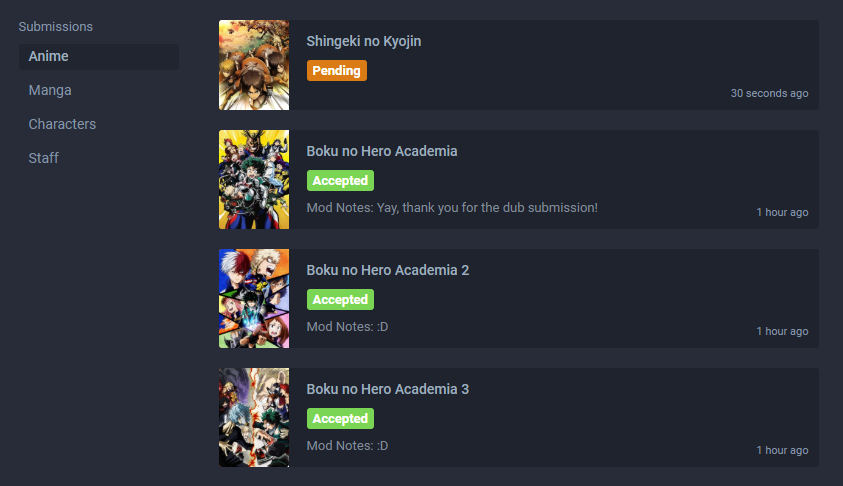

# Introduction

### Preface

Adding or modifying an entry on AniList is an easy task. The main focus is making sure that data is accurate and as complete as possible for that moment in time. All sections of the form are formatted in a similar fashion and have handy tool-tips to assist you.

## Adding New Entries

New entries can be submitted using these links:  
**Anime**: [https://anilist.co/edit/anime/new](https://anilist.co/edit/anime/new)  
**Manga**: [https://anilist.co/edit/manga/new](https://anilist.co/edit/manga/new)

New **Characters** and **Staff** can only be created through the anime and manga forms' [Character](#) and [Staff](#) sub-pages. This is the same whether you are submitting a new entry or editing an existing one.

## Editing Entries

Existing anime and manga entries can be edited using the edit button at the **bottom left** of their page.

Existing staff and character entries can be edited using the edit icon button at the **top right** of their page.

## Submission Approval

When a user provides a submission it will undergo a review process where a moderator can approve or deny the additions and/or changes made - it is extremely helpful to provide as many [sources](#) as possible to confirm the information you want to submit.

::: warning Please be aware that AniList does not handle all entries the same way that other sites do.
Examples:  
[Episode 0s and Prologues](#) are only placed in a standalone entry if they aired in a different format from the same series.

[Recap](#) episodes are not always included.

AniList has additional [relations](#). Labeling adaptations between all formats \(anime, manga, and light novel\) is also treated the same.
:::

After making a submission, you will be able to view the status of your submissions, plus receive comments and questions from any moderators working on it if required.

If you have any queries in relation to submitting or updating content on the site, feel free to ask a [moderator](#) on the [website](http://anilist.co) or on [Discord](http://discord.me/anilist).

::: tip
It is _**highly recommended**_ that you read the both the [Checklist](#) and [Animated](#) and [Written](#) Media Specification sections prior to any submissions, or at least relevant sections within it.

The latter sections state what _**is**_ and _**is not**_ accepted onto the database and provides many helpful tips within.
:::

::: warning Please Remember
This site is _**only**_ for works of Japanese, Korean, Chinese, and Taiwanese origins as specified in '[Country of Origin](#).'
:::

## Moderator List

::: tip
Feel free to contact a moderator for help and advice through the [website](http://anilist.co/) or on [Discord](http://discord.me/anilist) \#submission-support channel.

However, please don't give them a title and expect them to do all the work for you.
:::

#### Anime
 
| Name | Role | Role |
| :--- | :--- | :--- |
| [Taluun](http://anilist.co/user/21510) | Lead Anime |  |
| [Retui](http://anilist.co/user/1544) | Lead Anime |  |
| [Kazakuri](http://anilist.co/user/4659) | Anime \(Hentai\) |  |
| [Tiamo](http://anilist.co/user/44283) | Anime |  |
| [Watashi](http://anilist.co/user/923) | Anime |  |
| [Byrdn](http://anilist.co/user/2904) | Anime |  |
| [Zex](https://anilist.co/user/87028) | Anime |  |
| [Edo](https://anilist.co/user/40572) | Anime |  |
| [W8TERM3LON](https://anilist.co/user/57315) | Anime |  |
| [TACTICIANJACK](https://anilist.co/user/97263) | Anime |  |
| [safe](https://anilist.co/user/120925) | Anime |  |
| [Sakura](https://anilist.co/user/73541) | Anime |  |
| [Electrochemist](https://anilist.co/user/148769) | Anime |  |
| [Morimasa](https://anilist.co/user/97630) | Anime |  |
| [Odjn](https://anilist.co/user/103672) | Anime |  |
| [straykid](https://anilist.co/user/117432) | Anime |  |
 
#### Manga
 
| Name | Role | Role |
| :--- | :--- | :--- |
| [Mex](http://anilist.co/user/1790) | Lead Manga |  |
| [IdleSheep](https://anilist.co/user/122659) | Lead Manga |  |
| [Watashi](http://anilist.co/user/923) | Manga |  |
| [Subpyro](http://anilist.co/user/27211) | Manga |  |
| [Thunderplant](http://anilist.co/user/1828) | Manga |  |
| [Orangealaid](http://anilist.co/user/2272) | Manga |  |
| [InVale](http://anilist.co/user/57370) | Manga |  |
| [Sumia](http://anilist.co/user/4359) | Manga |  |
| [alice](http://anilist.co/user/20955) | Manga |  |
| [Silver](https://anilist.co/user/33516) | Manga |  |
| [nazo](https://anilist.co/user/109985) | Manga |  |
| [TGG](https://anilist.co/user/63817) | Manga |  |
| [Urtag](https://anilist.co/user/36596) | Manga |  |
| [Flidaix](https://anilist.co/user/139213) | Manga |  |
| [Yuuya](https://anilist.co/user/40553) | Manga |  |
| [Maora](https://anilist.co/user/125450) | Manga |  |
| [Dunkan85](https://anilist.co/user/123696) | Manga |  |
| [ScarletFairy](https://anilist.co/user/95901) | Manga |  |
| [Oterino](https://anilist.co/user/241165) | Manga |  |
 
#### Other Roles
 
| Name | Role | Role | Role |
| :--- | :--- | :--- | :--- |
| [Josh](http://anilist.co/user/1) | Lead Developer |  | Community |
| [matchai](http://anilist.co/user/2) | Lead Social Media | Developer | Community |
| [Mex](http://anilist.co/user/1790) | Social Media |  | Community |
| [Kazakuri](http://anilist.co/user/4659) | Developer |  | Community |
| [Retui](http://anilist.co/user/1544) | Social Media |  | Community |
| [Taluun](http://anilist.co/user/21510) |  |  | Community |
| [Zex](https://anilist.co/user/87028) |  |  | Community |
| [Electrochemist](https://anilist.co/user/148769) |  |  | Community |
| [Orangealaid](http://anilist.co/user/2272) |  |  | Community |
| [TACTICIANJACK](https://anilist.co/user/97263) |  |  | Community |
| [Maora](https://anilist.co/user/125450) |  |  | Community |