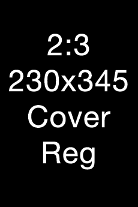
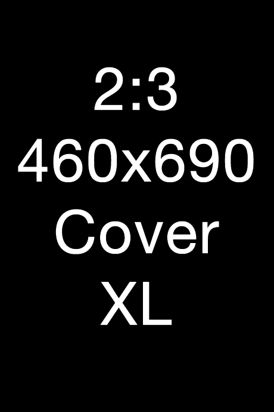

## Checklist

* Make sure the work, character, actor, or staff isn’t already in the database.
* Always include as much detail as possible, as well as link to as many sources as possible in the sources panel \(even if it is in a language you can’t read\).  
* If you find a duplicate entry, contact a [moderator](./#moderator-list).  
* The nationality of a creator does not matter if their work is first professionally published by a reputable Japanese, Chinese, South Korean, or Taiwanese publisher for their respective markets \(See [Country Of Origin](./submissions.html#country-of-origin)\).

Example:
 [Thiago Furukawa Lucas](https://anilist.co/staff/99212/Yuu-Kamiya) \(author of [No Game, No Life](https://anilist.co/manga/78399/No-Game-No-Life/)\) is Brazilian-Japanese, but the work was initially published with Kodansha in Japanese, so his work is considered a light novel.

::: tip
You can check by running English, native language, and romaji titles through the search and [browse](https://anilist.co/search/anime) sections, as well as going through the credits of relevant staff and characters.
:::

::: tip
If you’re unsure about anything, contact a [moderator](./#moderator-list) and they'll be happy to offer advice or help.

However, please do not expect that you can hand a moderator a link and have them do all the work for you.
:::

## Animated Media

### Anime

#### Database Criteria

There are limitations to the anime that can be accepted to the site, notably there should be significant creative control of the titles from Japanese studios and be professionally produced.

::: warning
Even if a title is animated by these studios, it may not be added to the site due to significant creative decisions being made by western companies.
:::

#### Examples

Example 1:

> [Bakemonogatari](https://anilist.co/anime/5081/Bakemonogatari/) was produced by the Japanese studio [Shaft](https://anilist.co/studio/44/Shaft), and the primary staff \(director, writers, etc\) are also Japanese.

Example 2:

> [RWBY](https://en.wikipedia.org/wiki/RWBY) has a Japanese dub and was broadcast on Japanese TV. However, as it was produced by an American company _\(Rooster Teeth_\) and its primary staff \(director, writers, etc.\) are also American, it would not meet the anime criteria for this database.

### Aeni

#### Database Criteria

There are limitations to aeni that can be accepted to the site, notably there should be significant creative control of the titles from South Korean studios.

::: warning
North Korean aeni is no longer accepeted.
:::

#### Examples

Example 1:

> [Closers: Side Blacklambs](https://anilist.co/anime/99527/Closers-Side-Blacklambs/) was produced by the Korean studio [Studio Animal](https://anilist.co/studio/6169/Studio-Animal) and the primary staff \(director, writers, etc\) are also Korean.

Example 2:

> [The Legend of Korra](https://en.wikipedia.org/wiki/The_Legend_of_Korra) was primarily animated by the Korean studio _Mir_, however, as it was produced by an American company \(_Nickelodeon_\) and the primary staff \(director, writers, etc.\) are also American, it would not meet our guidelines for an aeni show.


### Donghua

#### Database Criteria

There are limitations to donghua that can be accepted to the site, notably there should be significant creative control of the titles from Chinese and Taiwanese studios.

#### Examples

Example 1:

> [Ling Qi](https://anilist.co/anime/98031/Ling-Qi/) was produced by the Chinese studio [Haoliners Animation League](https://anilist.co/studio/6140/Haoliners-Animation-League) and the primary staff \(director, writers, etc.\) are also Chinese.  
>   
> While this show does have a Japanese dub, its original language was in Chinese. Due to its production, it would be classed as Chinese donghua and not a Japanese anime.

### Episode 0’s and Prologues

#### Database Criteria

Episode 0s and prologues that air as part of an upcoming series are included in the main series entry, _**not**_ separated into a single-episode entry.

::: tip
Episode 0s and Prologues that were released in a different format from the TV broadcast \(such as a web-only release or DVD-only release\) are still accepted and fall under the relevant media formats of OVA, ONA, and such.
:::

::: warning
This means that the episode count will be one higher than on other databases, such as [MyAnimeList](http://myanimelist.net), where prologues and episode 0s in the same series are separated into standalone entries.
:::

#### Examples

Example 1:

> [Fate/stay night: Unlimited Blade Works](https://anilist.co/anime/19603/Fatestay-night-Unlimited-Blade-Works/) '_Episode 0 - Prologue_' which aired just prior to the rest of the season.

Example 2:

> [Boku wa Tomodachi ga Sukunai Episode 0](https://anilist.co/anime/10897/Boku-wa-Tomodachi-ga-Sukunai-Episode-0/) was released as an [OVA](./criteria.html#ova) alongside a volume of the light novel. As the [format](./submissions.html#format) differs from the main TV series, it would have a separate entry.

### OVAs, ONAs, and Specials

#### Database Criteria

OVA’s \(Original Video Animations\), ONA’s \(Original Net Animations\), and Specials \(episodes that are aired similarly as the original broadcast but are aired separately\) are all permitted on AniList.

#### OVA

An OVA is a title that released directly to home video via something like VHS, LD, DVD, BD, etc.

For an OVA series to be combined into a single entry, it should be released on a semi-regular schedule and/or should have a shared continuity \(see Example 3\).

For OVA’s that are attached to a parent series, they should be combined only if they apply to the same parent series \(see Example 1\).

Example 1:

> [Yahari Ore no Seishun Love Comedy wa Machigatteiru. OVA](https://anilist.co/anime/18753/Yahari-Ore-no-Seishun-Love-Comedy-wa-Machigatteiru-OVA/), an OVA alongside the first season of the show, was bundled with a limited edition console game.  
>   
> However, another entry would be made if the OVA in question has a tie-in to a specific season, such as [Yahari Ore no Seishun Love Comedy wa Machigatteiru. Zoku: Kitto, Onnanoko wa Osatou to Spice to Suteki na Nanika de Dekiteiru](https://anilist.co/anime/21769/Yahari-Ore-no-Seishun-Love-Comedy-wa-Machigatteiru-Zoku-Kitto-Onnanoko-wa-Osatou-to-Spice-to-Suteki-na-Nanika-de-Dekiteiru/).

Example 2:

> [Kono Subarashii Sekai ni Shukufuku wo! OVA](https://anilist.co/anime/21574/Kono-Subarashii-Sekai-ni-Shukufuku-wo-OVA/), an OVA alongside the first season of the show, was bundled with a volume of the light novel.  
>   
> However, [Kono Subarashii Sekai ni Shukufuku wo! 2 OVA](https://anilist.co/anime/97996/Kono-Subarashii-Sekai-ni-Shukufuku-wo-2-OVA/), is its own separate entry as it was tied into the second season of the airing TV show.

Example 3:

> The show [Kidou Senshi Gundam UC](https://anilist.co/anime/6336/Kidou-Senshi-Gundam-UC/) was aired in a set schedule, with each episode following a singular continuity, so it is combined.

#### ONA

An ONA is a type of series that airs online for its original broadcast release.

#### Special

A work will be labeled special if the production company labels it as such. A special is also a work that is uniquely different than it’s parent series, whether that be a picture drama, a short, a pilot, etc.

### Recaps

#### Database Criteria

Recaps are only to be added if the format is different from the original \(Example: TV to Movie\).

::: warning
If a recap is aired mid-season as a part of the broadcast, it is _**not**_ to be added.

Recap specials that pre-air before the series are also not accepted.
:::

Other than the aforementioned format change, recaps are accepted under the condition that it is intended to be part of the series’ total episode count.

#### Examples

Example 1:

> [Re:CREATORS](https://anilist.co/anime/97980/ReCREATORS/) has a recap episode as its 13th episode that counts towards its 22 episode count. However, in [3-gatsu no Lion Recap \(MAL\)](https://myanimelist.net/anime/34647/3-gatsu_no_Lion_Recap), episode 11.5 is not a conventionally numbered episode, as denoted by the “.5”, and thus _**not**_ counted toward its total 22 episode count.
>
> Some titles will refer to these X.5 episodes with titles like “intermission”. In cases like these, they still will not be added to AniList.

### Experimental Shorts

#### Database Criteria

Experimental Shorts can be added to the website if it meets all the following criteria:

* Its creator has worked on professionally produced anime.  
* It meets the Japanese '[Country Of Origin](./submissions.html#country-of-origin)'.  
* The short is not based on existing published material \(anime, manga, manhwa etc.\) - it must be an _original_ work.

::: tip
Experimental Shorts created by a non-professional who later works on professionally produced anime may be retroactively added.
:::

::: warning
_Exceptions may be granted for student graduation projects from Japanese animation universities. This exception applies to first year graduation projects as well. In addition these entries should be listed as "Movie"._
:::

#### Examples

Example 1:

> [Rain Town](https://anilist.co/anime/10448/Rain-Town/) Is an experimental short by [Hiroyasu Ishida](https://anilist.co/staff/104852/Hiroyasu-Ishida). At the time of creation, he was an independent non-professional animator. As he has now worked on professionally produced works such as [Penguin Highway](https://anilist.co/anime/101249/Penguin-Highway/), this entry is acceptable.


### Advertisements and Commercials

#### Database Criteria

Advertisements are only permitted when they are directed by a person who has directed or produced a full-length series or movie.

#### Examples

Example 1:

> [Kyoto Animation: Ajisai-hen](https://anilist.co/anime/13259/Kyoto-Animation-Ajisaihen) is a commercial directed by [Shoko Ikeda](https://anilist.co/staff/102736/Shoko-Ikeda) and produced by [Kyoto Animation](https://anilist.co/studio/2/Kyoto-Animation).

Example 2:

> [Taisei Kensetsu: Sri Lanka Kousokudouro](https://anilist.co/anime/20536/Taisei-Kensetsu-Sri-Lanka-Kousokudouro/#) was directed by [Makoto Shinkai](https://anilist.co/staff/96117/Makoto-Shinkai), who has directed multiple full-length movies.


### Music Videos

#### Database Criteria

Music videos are permitted as long as there is _**significant**_ creative control from a Japanese creator. If it is unclear, ask a moderator for advice.

#### Examples

Example 1:

> [All Alone With You](https://anilist.co/anime/17901/All-Alone-With-You/) was produced by the Japanese studio, [8-bit](https://anilist.co/studio/4418/8bit), and directed by [Yuuichi Takahashi](https://anilist.co/staff/110749/Yuuichi-Takahashi).

Example 2:

> [Shelter](https://anilist.co/anime/97731/Shelter/) is a Canadian produced song. However, the music video was a collaborative work with the animation studio [A-1 Pictures](https://anilist.co/studio/561/A1-Pictures). It was directed by [Toshifumi Akai](https://anilist.co/staff/110949) as well as featuring voice acting by [Sachika Misawa](https://anilist.co/staff/102337/Sachika-Misawa).

Example 3:

> The music video for [Breaking the Habit \(Wikipedia\)](https://en.wikipedia.org/wiki/Breaking_the_Habit_%28song%29), by Linkin' Park, would not be eligible for the database. Although it did feature rotoscoped animation by Studio Gonzo, it was directed and produced by Joe Hahn and Eric Calderon respectively.


## Written Media

### Manga

#### Database Criteria

There is a limitation on manga that can be accepted to the site, notably they should be works that were first published through a reputable Japanese publisher. [Doujinshi](./criteria.html#doujinshi) is an exception, please refer to that section.

Example magazines include things such as:

:::: tabs :options="{ useUrlFragment: false }"

::: tab "Print Magazines"
- [Weekly Shounen Jump](https://www.shonenjump.com/j/index.html)
- [Comic Earthstar](https://comic-earthstar.jp/)
- [Dengeki Daioh](https://dengekidaioh.jp/)
- [Manga Time Kirara](http://www.dokidokivisual.com/)
- [Kindai Mahjong](http://kinma.takeshobo.co.jp/)
- [Betsuma](http://betsuma.shueisha.co.jp/)
:::

::: tab "Web Magazines"
- [Comic Bunch](http://www.comicbunch.com/)
- [Sunday Webry](https://www.sunday-webry.com/)
- [LEED Cafe](http://leedcafe.com/)
- [Dengeki @vitamin](http://gs.dengeki.com/vitamin/)
- [Ohta Web Comic](http://webcomic.ohtabooks.com/)
:::

::::

There are many sites that work with multiple publishers to release serializations digitally, such as [PixivComic](https://comic.pixiv.net/), [ComicWalker](https://comic-walker.com/), and [Nico Nico Seiga](https://seiga.nicovideo.jp/).

Works published on sites like [Twitter](https://twitter.com) or [Pixiv](https://www.pixiv.net)’s non-comic section are usually not accepted _**unless**_ they are titled works uploaded by an author already in serialization, in which they’ll be classed as [doujinshi](./criteria.html#doujinshi).

Any accepted works from [Comico](https://www.comico.jp) or similar webtoon portals should be from the official section only, and not the self-publishing challenge section.

::: tip
In the event of a series having several, simultaneously running serializations with no clear main series AND a volume release that contains chapters from multiple of those serializations, a seperate entry should be made for the volume releases. All serializations that have chapters in it are then to be connected to it through a Compilation relation.

Example: [Himegoto](https://anilist.co/manga/62833/Himegoto/)
:::

#### Doujinshi into Licensed Manga

If series originally self-published online through platforms like [Twitter](http://twitter.com) or [Pixiv](https://www.pixiv.net) \(considered [doujinshi](./criteria.html#doujinshi)\) are later picked up by a professional publisher and released without significant change, any existing entry in AniList under the doujinshi format would be updated to manga by checking the [Self Published](./submissions.html#self-published) option. \(retaining the original self-published start date\).

::: warning
If the serialization is an _**entirely**_ new work, and not a re-publication of the original chapters, a new entry should be made using the start date as the date of serialization. The original work could still be eligible to enter the database as doujinshi.
:::

#### Examples

Example 1:

> [Senpai ga Uzai Kouhai no Hanashi](https://anilist.co/manga/103111/Senpai-ga-Uzai-Kouhai-no-Hanashi/) was first released on Twitter \([here](https://twitter.com/i/moments/969629425087082498)\) for a short period of time before the publisher [Ichijinsha](http://ichijinsha.co.jp) began collating the original Twitter posts into tankoubon \([here](https://bookwalker.jp/series/156182/list/)\).  
>   
> Ichijinsha's publication is of the original work itself \(with redrawn art for earlier chapters\) and not a new story. If the entry did already exist on AniList as [doujinshi](./criteria.html#doujinshi), it would have been be updated to manga and the cover later updated to the tankoubon volume.

Example 2:

> [Sanpakugan-chan wa Tsutaetai.](https://anilist.co/manga/103184/Sanpakuganchan-wa-Tsutaetai/) was first released on Twitter \([here](https://twitter.com/syunsuke1009/status/1004317076788408320)\) before the publisher [GANGANpixiv](https://gangan.pr-pixiv.net/) began serialization.  
>   
> Like the first example, this also could have been eligible to be entered as doujinshi at first, if meeting the other requirements.
>
> Also like the first example, the serialization is a re-publication of the first chapters with minor adjustment.


### Manhua

#### Database Criteria

There is a limitation on manhua that can be accepted to the site, notably they should be professionally published works through a reputable Chinese publisher.

::: tip
Refer to the [Web Platform List](./criteria.html#web-platform-examples) for a list of most major professional publishers.
:::

::: warning
Works should _**not**_ be published through self-publishing platforms such as [Tapas.io](https://tapas.io). This condition can be waived if an official adaptation/translation of existing professionally published material is being legally hosted on one of these sites or if the title in question is later picked up by a professional publisher _**of the same language.**_
:::

[Sina Weibo Manhua](http://manhua.weibo.com/), [Douban eBook publications](https://read.douban.com/) \(and other companies like them\) are generally acceptable as they review titles before deciding to publish them on their platforms.

::: tip
At times, you will see works often listed with three separate authorship entries on sites like [QQ](http://ac.qq.com/), which can be linked to the below [staff roles](./submissions.html#staff-role). This could mean multiple ‘Story’ credits.

作者 - Story  
图 - Art  
文 - Story
:::


### Manhwa

#### Database Criteria

There is a limitation on manhwa that can be accepted to the site, notably they should be professionally published works through a reputable South Korean publisher.

::: warning
North Korean manhwa is no longer accepted.
:::

::: tip
Refer to the [Web Platform List](./criteria.html#web-platform-examples) for a list of most major professional publishers.
:::

Works from parts of sites \(and others\) where anybody can submit works, such as [Naver](https://comic.naver.com/)’s '_Best Challenge/Challenge_' section, or [Daum](http://webtoon.daum.net/)’s '_League_' section are _**not**_ acceptable.

::: warning
Works should _**not**_ be published through self-publishing platforms such as [Tapas.io](https://tapas.io). This condition can be waived if an official adaptation/translation of existing professionally published material is being legally hosted on one of these sites or if the title in question is later picked up by a professional publisher _**of the same language.**_
:::

[Kakao Page](https://page.kakao.com/main) \(and other companies like them\) are generally acceptable as they review titles before deciding to publish them on their platforms.


### Doujinshi

#### Database Criteria

Doujinshi can be added to the website if it meets all the following criteria:

1. The doujinshi is by an _**already**_ serialized mangaka.
2. The doujinshi must be of Japanese [origin](./submissions.html#country-of-origin).
3. The doujinshi is not based on existing published material \(anime, manga, manhwa, etc.\) - it must be an _**original**_ work.

Doujinshi is not a format on AniList, instead, you have to the toggle the [Self Published](./submissions.html#self-published) option.

::: warning
The ‘_original work_’ rule can be waived if the doujinshi in question is by the original author of the existing material or by staff who directly worked on an anime project.

Example 1:<br>
[R of Black Lagoon](https://anilist.co/manga/87131/R-of-Blacklagoon/) is a doujinshi of [Black Lagoon](https://anilist.co/manga/30735/Black-Lagoon/) published by the original author, [Hiroe Rei](https://anilist.co/staff/97578/Rei-Hiroe).

Example 2:<br>
[RKGKMDK](https://anilist.co/manga/60257/) is a doujinshi of [Mahou Shoujo Madoka★Magica](https://anilist.co/anime/9756/) by the original character designer, [Ume Aoki](https://anilist.co/staff/97969/).
:::

::: tip
Some doujinshi that enter serialization may be converted to the manga format provided the new serialization is not an entirely new work. Please refer to [Manga](./criteria.html#doujinshi-into-licensed-manga) for more information.
::: 

::: warning
One-off doujinshi are _**not**_ to be labeled as one-shot. Please refer to [One-Shots](./criteria.html#one-shots). Instead, select **manga** from the format field.
:::

### Light Novels

#### Database Criteria

Light novels can be added to the website if they meet all the following criteria:

1. The light novel must be of Japanese [origin](./submissions.html#country-of-origin).
2. The light novel must be professionally published through a reputable publisher from companies such as [Kadokawa](https://www.kadokawa.co.jp/), [Kodansha](http://www.kodansha.co.jp/), [Alphapolis](https://www.alphapolis.co.jp/), and [Hobby Japan](http://hobbyjapan.co.jp/).
3. The light novel is specified as being such by the author, original publisher, or the majority of major Japanese retailers.

::: warning
Should a light novel be promoted to a regular novel, the light novel may remain on the site so long as its first publication is labeled as one.

Example: [Koten-bu Series](https://anilist.co/manga/65513/Kotenbu-Series/) was initially published under the light novel label *Kadokawa Sneakers Bunko*, but moved to *Kadokawa Shoten* in 2005.
:::

#### Example light novel labels include:
- [Dengeki Bunko](https://dengekibunko.jp/)
- [MF Bunko J](https://mfbunkoj.jp/)
- [Kadokawa Sneaker Bunko](https://sneakerbunko.jp/)
- [Famitsu Bunko](http://fbonline.jp/)
- [HJ Bunko](http://hobbyjapan.co.jp/hjbunko/)
- [Gagaga Bunko](http://gagagabunko.jp/)
- [GA Bunko](https://ga.sbcr.jp/)
- [Media Works Bunko](http://mwbunko.com/)
- [Alpha Light Bunko](http://www.alphalight-books.com/)
- [Kodansha Lanove Bunko](http://lanove.kodansha.co.jp/)
- [Puchipara Bunko](http://parabook.co.jp/novels/puchipara.php) \(**adult**\)
- [Bishoujo Bunko](http://www.bishojobunko.jp/) \(**adult**\)

::: warning
Tokuten \(bonus booklets and such\) will not be added to the database.
:::

Web novels from Japanese self-publishing websites such as [Syosetu](http://syosetu.com) are _**not**_ allowed.

::: warning
If a self-published web novel from a site such as [Syosetu](http://syosetu.com) is later professionally published as a light novel, the **light novel** entry would be eligible for submission under the date that the light novel serialization began.

The original web novel publication should _**not**_ be added.
:::

::: danger
Chinese and South Korean web novels are _**not**_ accepted on this website.
:::

#### Examples

Example 1:

> The original self-published [Syosetu](http://ncode.syosetu.com/s2691b/) release of [KonoSuba](https://anilist.co/manga/86238/Kono-Subarashii-Sekai-ni-Shukufuku-wo/) is _**not**_ permitted, however, the [Kadokawa](https://kadokawa.co.jp) published [light novel serialization](https://sneakerbunko.jp/series/konosuba/) under their [Sneaker Bunko](https://sneakerbunko.jp/) imprint _**is**_ allowed.

Example 2:

> The [Monogatari Series](https://anilist.co/manga/44893/) toes the line between appearing as a hard or light novel. It is [published](http://kodansha-box.jp/topics/nishio/index.html) in [Kodansha BOX](http://kodansha-box.jp/), which is a hybrid label, but the work is mixed media \(contains illustrations\) and is mostly labeled as a light novel by the general community in both Japan and overseas \(readers, large retailers etc\).

Example 3:

> [Spice and Wolf](https://anilist.co/manga/39115) debuted as a prize-winning work in the 12th Dengeki Novel Awards. This awarded it serialization in [Dengeki Bunko](https://dengekibunko.jp/product/spice-and-wolf/), a light novel imprint.


### One-Shots

#### Database Criteria

One-shots can be added to the site provided they been published in a reputable, professional, Japanese, South Korean or Chinese magazine or publisher.

They are single, standalone works with a self-contained story. This means that any series with more than one chapter is _**not**_ a one-shot.

::: tip
If a published one-shot has a serialization announced, a new entry will be created for the new serialization under the **manga** format. The two works will be linked through the **alternative** [relation](./submissions.html#relations).
:::

::: warning
If a one-shot was published in a volume, and not as standalone, it should _**not**_ have a standalone entry.
:::

::: warning
Self-published works are not classed as one-shots. One-shots only appear in official publications and are labelled as 読み切り (or 'yomikiri'). However, if the author is already serialized, self-published works could instead possibly be classed as [doujinshi](./criteria.html#doujinshi).
:::

### Compilations/Anthologies

Compilations or Anthologies are hereby understood as collections of short, usually independent stories. They come in three varieties:

* A compilation of one-shots which were previously published in a magazine (example: [Oogiri](https://anilist.co/manga/94659/))
* A compilation of stories never released before. (example: [Yagate Kimi ni Naru Koushiki Comic Anthology ](https://anilist.co/manga/106794/))
* A mixture of the two.

For works that compile previously released one-shots, it is acceptable for _**both**_ the standalone one-shot and the collection it is compiled into to be added to the website. These must be linked through the "**contains**" and "**compilation**" [relations](./submissions.html#relations).

Example:

> The now-defunct magazine, _Pure Yuri Anthology Hirari_, which solely published one-shots, released an anthology containing a selection of six of their one-shots:
>
> Adding [Isshun no Asterism](https://anilist.co/manga/104980) \(one-shot\) _to_ [_Shuuden ni wa Kaeshimasu_](https://anilist.co/manga/85662/Shuuden-ni-wa-Kaeshimasu/) _\(anthology\) with the '_**contains'** _relation automatically adds_ [_Shuuden ni wa Kaeshimasu_](https://anilist.co/manga/85662/Shuuden-ni-wa-Kaeshimasu/) _as the ''_**compilation'** to [Isshun no Asterism](https://anilist.co/manga/104980), and vice versa.

In the case of retroactively creating standalone entries when the compiled volume already exists in the database, the standalone one-shot _**must**_ have the date when it was first published, not the date the anthology or collection was published \(where applicable\).

Anthologies and compilations should have _**both**_ start and end dates set to the day that the book was released, not the dates between oldest and newest one-shots contained within (if there are any).

::: warning
All anthologies and one-shot compilations must have the **Manga** [format](./submissions.html#format).
:::

Anthologies should also be joined into a single entry if the volumes are distinguished by incremental numbering (example: vol 1, vol 2, vol 3, etc.). If they don't have any form of incremental numbering however, they should be separated into different entries, and these different entries should be related to one another using the prequel and sequel relation based on the release date of each anthology.

Example: 

> The manga [Gakkou Gurashi!](https://anilist.co/manga/85235/Gakkou-Gurashi/) has 3 anthology comics: [Gakkou Gurashi! Anthology Comic: On](https://anilist.co/manga/105383/), [Gakkou Gurashi! Anthology Comic: Kai](https://anilist.co/manga/105384/), and [Gakkou Gurashi! Anthology Comic: Goku](https://anilist.co/manga/105385/). Neither of the three anthologies have any sort of numbering scheme distinguishing them, they're distinguished by title alone, therefore they remain separate entries, and they're related to each other via prequel/sequel relations using their release date to decide which one is first. In contrast, [K-on!](https://anilist.co/manga/43001/KOn/) has the anthology [K-On! Anthology Comic](https://anilist.co/manga/49551/KOn-Anthology-Comic/), where every volume is distinguished only by a number, therefore all the volumes are grouped into a single entry.

### Web Platform Examples

The below list contains examples of popular multi-publisher web platforms or self-publishing services. This is only for referencing and is not a complete list of what platforms are or are not allowed.

::: tip
If one of the below accepted links exist, please add them to the [External Links](./submissions.html#external-links). Additionally, [Toko Mavo](http://toko.takekuma.jp/), [Pixiv](http://pixiv.net), and [Twitter](http://twitter.com/) links can still be used for eligible [doujinshi](./criteria.html#doujinshi).
:::

::: warning
As always, works still have to satisfy the Japanese, Chinese, South Korean, or Taiwanese ‘[Country Of Origin](./submissions.html#country-of-origin)’ type.
:::

If the work originally published on ‘_Not Accepted_‘ websites is later picked up by a professional publisher of _**the same language**_, that later publication would be what can be added to the database.

:::: tabs :options="{ useUrlFragment: false }"
::: tab Accepted
Japanese  
- [https://comic.pixiv.net](https://comic.pixiv.net/)  
- [https://comic-walker.com](https://comic-walker.com/)  
- [https://www.comico.jp](https://www.comico.jp/) \(Official works only, not Challenge\)  
- [https://piccoma.com](https://piccoma.com/web/)  
- [https://sai-zen-sen.jp](https://sai-zen-sen.jp/comics/twi4/)  
- [http://seiga.nicovideo.jp](http://seiga.nicovideo.jp/) \(Only with the official \(公式\) serialization header\)
- [https://xoy.webtoons.com/ja](https://xoy.webtoons.com/ja) \(Official words only, not League\)

Chinese  
- [http://ac.qq.com](http://ac.qq.com)  
- [https://www.dajiaochongmanhua.com](https://www.dajiaochongmanhua.com/)
- [https://www.dongmanmanhua.cn/](https://www.dongmanmanhua.cn/)
- [https://www.kaimanhua.com/](https://www.kaimanhua.com/)
- [http://www.kuaikanmanhua.com](http://www.kuaikanmanhua.com/)  
- [https://www.manmanapp.com](https://www.manmanapp.com/)  
- [http://manhua.weibo.com](http://manhua.weibo.com/)  
- [https://www.manhuatai.com/](https://www.manhuatai.com/)
- [https://manga.bilibili.com/](https://manga.bilibili.com/)
- [https://read.douban.com](https://read.douban.com/)  
- [https://www.zymk.cn/](https://www.zymk.cn/)

South Korean  
- [http://bomtoon.com](http://bomtoon.com)
- [https://comic.naver.com](https://comic.naver.com/) \(Featured works only, not Challenge\)  
- [https://www.justoon.co.kr](https://www.justoon.co.kr/)  
- [https://www.lezhin.com](https://www.lezhin.com/)  
- [https://m.mrblue.com/](https://m.mrblue.com/)
- [https://page.kakao.com](https://page.kakao.com/)  
- [http://toomics.com](http://toomics.com/)  
- [https://toptoon.com/](https://toptoon.com/)
- [http://webtoon.daum.net](http://webtoon.daum.net/) \(Official works only, not League\)  
:::

::: tab "Not Accepted"
Japanese  
- [http://www.pixiv.net](http://pixiv.net/) \(However [PixivComics](https://comic.pixiv.net/) is allowed\)
- [http://www.syosetu.com](http://syosetu.com/)  
- [http://toko.takekuma.jp](http://toko.takekuma.jp/) \(However [Dennou Mavo](http://mavo.takekuma.jp/) is allowed\)  

Chinese  
- [http://u17.com](http://u17.com)

Multi-language  
- [https://www.smackjeeves.com/](https://www.smackjeeves.com/) \(Featured works on [Comico](https://www.comico.jp/) are allowed.\)
- [https://www.tapas.io](https://tapas.io/)  
- [https://www.tappytoon.com/](https://www.tappytoon.com/)
- [https://www.twitter.com](https://www.twitter.com)  
- [https://www.webcomicsapp.com/](https://www.webcomicsapp.com/)
- [https://www.webtoons.com](https://www.webtoons.com/) \(Featured works on the Korean \([NAVER](https://comic.naver.com/)\) and Japanese \([XOY](https://xoy.webtoons.com/ja/)\) equivalents are allowed.\)
:::

::::

Any submission that includes a link source from the multi-language section does not automatically result in a rejection. Try to find another source from the approved websites list, sometimes provided by MangaUpdates, and check to see if the native site's release dates occurred first.  

Example 1: 

> [_The Beloved Little Princess_](https://anilist.co/manga/117320/) was originally published by [KakaoPage](https://page.kakao.com/home?seriesId=54680399&page=1) on March 26, 2020 and later picked up by [Tappytoon](https://www.tappytoon.com/en/comics/beloved-little-princess).

Example 2:

> While it's available on [KakaoPage](https://page.kakao.com/home?seriesId=53142176) as of June 2019, _The Beginning After the End_ fails our qualifications as it was originally published by [Tapas](https://tapas.io/series/tbate-comic/info) on July 7, 2018.


## Sourcing

### Websites

There are endless sources for all types of media, some can be more useful or informative than others. Whilst this list isn’t exhaustive by any means, it could provide some helpful pointers to where you can find new or old information.

::: tip
If you find an article or source in a language you can’t read, linking it for moderators to look at is still extremely helpful.
:::

#### General Sites

* In most cases, _**official**_ sites are the best possible source and contain the most information. Providing these as often as possible is ideal. Especially since these sites should be linked in the External URL section of the form.  
* Sources in the native language are extremely helpful - even if you’re unable to read it. Searching the native title can bring up relevant news articles or, for a lot of digitally published works, sites where they are legally hosted \(Example: [PixivComic](https://comic.pixiv.net/), [Nico Nico Seiga](https://seiga.nicovideo.jp/), and [ComicWalker](https://comic-walker.com/)\).  
* News sites are usually fine, but double-checking the sources they reference can be useful.  
* [Media Arts Database](https://mediaarts-db.bunka.go.jp/) is an amazing resource managed by the Agency for Cultural Affairs’ for all manner of information, from animated series, to manga tankoubon, to print magazines dating over fifty years old. Always worth taking a look to see what’s there.  \(Examples: [Dennou Coil](https://mediaarts-db.bunka.go.jp/id/C11309?lang=en), [Weekly Manga TIMES](https://mediaarts-db.bunka.go.jp/id/C117668?lang=en)\)

::: warning
Please remember that magazine issue date is not always the month the magazine was released. Many issues release a month or two earlier than titled. Checking on-sale dates on the magazine's website or sites like [Amazon](https://www.amazon.co.jp/) is required.
:::

* [AniDB](https://anidb.net) is very good at tracking staff roles, but names should always be double-checked for accuracy.  \(Example: [Ginga Eiyuu Densetsu](https://anidb.net/perl-bin/animedb.pl?show=anime&aid=584)\)  
* [Wikipedia Japan](https://ja.wikipedia.org/) can be good for information on characters, as well as specific magazine issues for print serialization manga. \(Example: [Hibiki: Shousetsuka ni Naru Houhou](https://ja.wikipedia.org/wiki/響_〜小説家になる方法〜)\) 
* [Pixiv Encyclopedia](https://dic.pixiv.net/) can often be useful for not only character names, but all manner of information, similar to Wikipedia, a lot of information gets collated into series pages.
* [MyAnimeList](https://myanimelist.net/), [MangaUpdates](https://www.mangaupdates.com/), and [Kitsu](https://kitsu.io/explore/anime) are often sourced - whilst this is OK, these alone aren’t always accurate enough, as they can often contain errors. However, please link the first two if they exist, especially as [AniList](http://anilist.co) _**requires**_ the works' [MAL ID](./submissions.html#myanimelist-id) for mapping series between the two websites for list imports.  
* Anime and manga aggregators \(streaming/scanlation hosting sites\) should almost never be used as a single or primary source. They usually lack or have incorrect data.

#### Anime Specific

* [Moon Phase](http://m-p.sakura.ne.jp/) for airing times, TV stations, etc.
* [Syoboi Calendar](http://cal.syoboi.jp/) is also handy for airing times and checking delays.
* [Yaraon!](http://yaraon-blog.com/) \(**NSFW**\) is a pretty nifty blog for announcements.
* [Anime@wiki](https://w.atwiki.jp/anime_wiki/) for staff positions and episodes.
* [Anime Staff Database](http://seesaawiki.jp/w/radioi_34/) for animation staff positions and episodes.
* [FanSubDB](http://fansubdb.com/wiki/) is OK for airing times, but get additional confirmation.

#### Manga Specific

* [Natalie 'New Serialization' tag](https://natalie.mu/comic/tag/43) - Articles about new serials.
* [Natalie 'Completed Serialization' tag](https://natalie.mu/comic/tag/42) - Articles about ending serials.
* [Natalie 'Vol. 1 Release' tag](https://natalie.mu/comic/tag/59) - Articles about first volume releases.
* [Namu Wiki](https://namu.wiki/) \(South Korea\) for character information, source material and release dates.
* [Webtoon Guide](https://www.webtoonguide.com/en/) \(South Korea\) for platform compilation and release dates.


### Tools

#### Japanese Dictionary Extensions

If you're trawling through Japanese articles and announcements, these can be very helpful browser extensions if you have knowledge of kana.

All below extensions will provide popups of various kana readings and interchangeable dictionary definitions when hovering over Japanese text.

| Google Chrome | Firefox |
| :--- | :--- |
|  [rikaikun](https://chrome.google.com/webstore/detail/rikaikun/jipdnfibhldikgcjhfnomkfpcebammhp) | [Rikaichamp](https://addons.mozilla.org/en-US/firefox/addon/rikaichamp/) |
|  [Yomichan](https://chrome.google.com/webstore/detail/yomichan/ogmnaimimemjmbakcfefmnahgdfhfami) | [Yomichan](https://addons.mozilla.org/en-US/firefox/addon/yomichan/) |

#### Bookwalker Cover Grabber

[Book Walker](https://bookwalker.jp)'s often very large volume covers can be very useful for use in making character images or banners, or simply to have a very high quality cover you can immediately upload to the website for the [XL cover](./criteria.html#image-dimensions-and-templates) feature.

* Make a new bookmark and paste the following JavaScript in the Address/URL field:

```javascript
javascript:(function(a){var b=document.createElement("textarea"),c=document.getSelection();b.textContent=a,document.body.prepend(b),b.style.position='fixed'}("https://c.bookwalker.jp/coverImage_" + (parseInt($('meta[property="og:image"]').attr('content').split("/")[3].split("").reverse().join(""))-1) + ".jpg"))()
```

* Find the volume you want to use the cover of and press the bookmark

  Example: [紺田照の合法レシピ（１）](https://bookwalker.jp/deae06677d-973d-42d1-bfb3-f24d841dbd13/)

* A box will pop up containing a direct link to the larger image which you can paste into a new tab to access and save. Example: [https://c.bookwalker.jp/coverImage\_1936781.jpg](https://c.bookwalker.jp/coverImage_1936781.jpg)

::: tip
[Image Max URL,](https://qsniyg.github.io/maxurl/) a website and userscript that redirects images to the original versions, has Bookwalker functionality included as of [0.74](https://github.com/qsniyg/maxurl/commit/5d5a77c08f9461c5d7c4ceac209fca240b776d7b#diff-27f9d4a32bb1055d6e25712679ce34afR21594) - [https://github.com/qsniyg/maxurl](https://github.com/qsniyg/maxurl).

Please be aware that the userscript affects a large number of sites, which may not be desired.
:::

## Title Formatting

There should be _consistent_ formatting when converting from and/or using native and romaji titles.

### Japanese Romanization

The romanization of Japanese names and titles is done in a variation of [Traditional Hepburn](https://en.wikipedia.org/wiki/Hepburn_romanization#Variants).

* Macrons are _**not**_ used.  
* Loanwords are written properly in their respective languages  \(Example: _Maid_ instead of _Meido_\).  
* Alternate spellings advocated by the creator\(s\) of the work are applied, if required.  
* Things such as 'っち', 'っちゃ', and 'っちょ' are romanized as 'cchi', 'ccha', and 'ccho' respectively. This is opposed to the traditional 'tchi', 'tcha', and 'tcho'.  
* 'を' is written as 'wo'.
* 'ん' is always written as 'n'.  
* Words adopted into English are written in that standard  \(Example: _Tokyo_ and _Osaka_ instead of _Toukyou_ and _Oosaka_ respectively\).  
* Full-width punctuation should _**always**_ be converted to half-width or equivalent. \(。to . , ！to ! , ？to ?\)

Examples:

| Native Title | Romaji Title |
| :--- | :--- |
| シティーハンター | City Hunter |
| 銀河の死なない子供たちへ | Ginga no Shinanai Kodomotachi e |
| ニア アンダーセブン | NieA Under 7 |
| たまゆら ～もあぐれっしぶ～ | Tamayura: More Aggressive |
| 俺の妹がこんなに可愛いわけがない | Ore no Imouto ga Konnani Kawaii Wake ga Nai |
| 乙女ゲー世界はモブに厳しい世界です | Otomege Sekai wa Mob ni Kibishii Sekai desu |
| ふたご、ふたごころ。 | Futago, Futagokoro. |
| 滅び時だと彼女は告げた \#異能犯罪捜査〈零局〉 | Horobi Doki dato Kanojo wa Tsugeta \#InouHanzaiSousa &lt;Rei Kyoku&gt; |
| 君の膵臓をたべたい | Kimi no Suizou wo Tabetai |

### Korean Romanization

#### Titles

The romanization of Korean titles is done using the [Revised Romanization of Korean](https://en.wikipedia.org/wiki/Revised_Romanization_of_Korean) with some modifications.

* Loanwords are written properly in their respective languages (Example: Secret instead of Sikeurit)
* Personal names follow their own guidelines. See below.

::: tip
We recommend using tools such as [Korean Romanization Converter](http://roman.cs.pusan.ac.kr/input_eng.aspx?) for those unfamiliar with romanization. Please make sure that whatever tool you're using follows the Revised Romanization rules, not other romanization systems such as the McCune-Reischauer Romanization. In the case of the tool linked, previously it's the romanization marked with (1).
:::

Examples:

| Native Title | Romaji Title |
| :--- | :--- |
| 후레자식 | Hurejasik |
| 그녀가 공작저로 가야 했던 사정 | Geunyeoga Gongjagjeolo Gaya Haessdeon Sajeong |
| 아가씨와 우렁총각 | Agassiwa Ureongchonggak |
| 나 혼자만 레벨업 | Na Honjaman Level Up |
| 슈퍼 시크릿 | Super Secret |
| 갓 오브 하이스쿨 | God of High School |

#### Names

For Korean character and staff names, due to the lack of standardization, the Revised Romanization of Korean might not always be preferred. The following bullet points list which system is preferred from most to least preferred.

* If an official translation that doesn't convert the name exists, the romanization showed in said translation is always preferred.
* If an official version does not exist, we allow user/mod discretion in picking the romanization that is most commonly used online.
* If there is no apparent preference in what romanization is used, the name should be romanized using Revised Romanization rules.

**Other important notes:**

* Regardless of the romanization system chosen, alternative spellings that are in use can and should be added to the alternative names field.
* The given names of Korean characters and staff should be hyphenated (see the "[Allowed]" version in the Korean Romanisation Converter). 
* Name conversions (example: Seung-u changed to Victor) are never preferred, even if they are used officially!
* It is possible that a Korean person or character has their name written in hanja, an old Korean writing system consisting of Chinese characters. In those cases, please refer to [this hanja table](http://koreangenealogy.org/book/names/given-names/) for romanization.

::: warning
It is entirely possible for two people/characters to have the same native name yet different romanizations due to the lack of name standardization. Do not assume that the same native name is always romanized the same. Always use the priority list above.
:::

Examples:

| Native Name | Romaji Name | Note |
| :---| :---| :--- |
| 서주혁 | Seo Joo-Hyuk | Official translation |
| 윤승호 | Yoon Seung-Ho | Official translation |
| 안시하 | Ahn Si-Ha | Popular use |
| 채유화 | Chae Yoo-Hwa | Popular use |
| 진세하 | Jin Se-Ha | Revised Romanization |
| 朴秄英 | Park Ja-Yeong | Hanja conversion |

### Chinese Romanization

The romanization of Chinese names and titles is done using [Hanyu Pinyin](https://en.wikipedia.org/wiki/Pinyin) with some modifications:

* Tone marks (macron, caron, acute accent, and grave accent) are not used.
* Apostrophes and hyphens are not used
* 之 should be romanized as : when being used as such, but has to be romanized as zhi when used as a possessive.
* Season markers such as 第二季 or 第1季 are romanized as just their number (so "2" instead of "season 2") and markers such as 上半季, 下半季, 上部, 下部, 上, and 下 should be romanized as "part 1" or "part 2".

**Important notes:**

* Please keep the umlaut for the ü vowel as this is a different vowel altogether from u.
* Compound words have their syllables joined together, not separate (example: Tamen instead of Ta Men). If there it's not clear something is a compound, the syllables should be separate.

:::tip
We recommend using tools such as [MDBG](https://www.mdbg.net/chinese/dictionary) for those unfamiliar with romanization, just remember to adjust the results to fit our modifications.
:::

Examples:

| Native Title | Romaji Title |
| :--- | :--- |
| 我老婆是魔王大人 | Wo Laopo Shi Mowang Daren |
| 妖神记之黑狱篇 | Yao Shen Ji: Hei Yu Pian | 
| 封神記 | Feng Shen Ji |
| 灵域 第二季 | Ling Yu 2 |

### Title Modification

#### Unconfirmed Titles for Additional Seasons

For works getting a new series or season and the official title is as of yet unconfirmed, or never confirmed, please append the series number alone to the end of native and romaji titles, and 'Season X' to the end of the English title.

Example

> A [third season](https://anilist.co/anime/99147/Shingeki-no-Kyojin-3/) is announced but not given any proper titles. Until then the titles would be:  
>   
> Native: 進撃の巨人３  
> Romaji: Shingeki no Kyojin 3  
> English: Attack on Titan Season 3

#### Split Seasons

If a 'season' of the show will air for multiple seasons, but has at least a one [airing season](./submissions.html#season) gap in between. The subsequent entries should have 'Part 2' or equivalent if no official title is given.

Example

> The third season began airing in Summer 2018, but misses Fall 2018, Winter 2019 and [continues](https://anilist.co/anime/104578/Shingeki-no-Kyojin-3-Part-2/) in Spring 2019. The titles would be:  
>   
> Native: 進撃の巨人３  
> Romaji: Shingeki no Kyojin 3 Part 2  
> English: Attack on Titan Season 3 Part 2

#### Appendages

For supplemental works to a main series, such as [OVAs and Specials](./criteria.html#ovas-onas-and-specials), the main series title should be used and the format appended to the end.

Example:

> '[Fate/kaleid liner Prisma☆Illya](https://anilist.co/anime/14829/Fatekaleid-liner-PrismaIllya/)' has a side story with the title '[Fate/kaleid liner Prisma☆Illya Specials](https://anilist.co/anime/19109/Fatekaleid-liner-PrismaIllya-Specials/)'.

### Untitled or Provisionally Titled Media

It is fine to add newly announced original work with no title or a provisional title providing there is still an official source to verify it. This is most common in manga magazines where announcements can be made for an author's new work months in advance.

If the media has no title, please use `(Title to be Announced)` in the romaji and native fields.

If the media has a provisional title, please append `(Provisional Title)` to the end of the romaji title, and `（仮）` to the end of the native title.

It is highly recommended to write a temporary description containing the date of the announcement, a link to a reputable article or website, and the author.

**Example:**
> _Serialization of Shouto Aya's new work - announced 2018/10/25 - presently untitled._ [Announcement Link](http://www.ganganonline.com/contents/big32018/)

::: warning
Remember to follow news for the series so that the title can be updated as soon as possible.
:::

### Special Characters

::: tip
Examples of how to deal with non-alphanumeric characters in titles can be seen in the table below. If uncertain, contact a [moderator](./#moderator-list).
:::

* Titles which feature subtitles separated full-width tildes \(～\) or other similar separators should be separated with a colon or hypen. The only preference is what formatting is most commonly used elsewhere.
* Japanese quotes \(「」\) should be converted to English double-quotes \(" "\).  
* Symbols like stars \(☆\) and musical notes \(♪\) should remain.  
* Titles using full-width tildes to elongate words should be [romanized](./criteria.html#japanese-romanization) without. \(み〜つけた &gt; Mitsuketa\).  
* Hashtags in titles should remain without spaces when romanized, however, a version with spaces should ideally be placed in the synonyms.  
* Special things such as kaomoji \(顔文字\) should not be romanized.

#### Examples

| Native | Romaji |
| :--- | :--- |
| 寄生獣 セイの格率 | [Kiseijuu: Sei no Kakuritsu](https://anilist.co/anime/20623/Kiseijuu-Sei-no-Kakuritsu/) |
| たまゆら ～もあぐれっしぶ～ | [Tamayura: More Aggressive](https://anilist.co/anime/15731/Tamayura-More-Aggressive/) |
| 遊☆戯☆王　デュエルモンスターズ | [Yu☆Gi☆Oh! Duel Monsters](https://anilist.co/anime/481/YuGiOh-Duel-Monsters/) |
| らき☆すた | [Lucky☆Star](https://anilist.co/anime/1887/LuckyStar/) |
| ジョジョの奇妙な冒険 黄金の風 | [JoJo no Kimyou na Bouken: Ougon no Kaze](https://anilist.co/anime/102883/JoJo-no-Kimyou-na-Bouken-Ougon-no-Kaze/) |
| 傷物語〈Ⅲ冷血篇〉 | [Kizumonogatari III: Reiketsu-hen](https://anilist.co/anime/21400/Kizumonogatari-III-Reiketsuhen/) |
| たまゆら～卒業写真～　第1部 芽-きざし- | [Tamayura: Sotsugyou Shashin Part 1 - Kizashi](https://anilist.co/anime/20805/Tamayura-Sotsugyou-Shashin-Part-1--Kizashi/) |
| スコップ無双　「スコップ波動砲！」　\(　｀・ω・´\)♂〓〓〓〓★\(゜Д　゜　;;;\).:∴ドゴォォ | [Scoop Musou: "Scoop Hadouhou!" \( ｀・ω・´\)♂〓〓〓〓★\(゜Д゜ ;;\) .:∴ドゴォォ](https://anilist.co/manga/104759) |
| 三白眼ちゃんは伝えたい。 | [Sanpakugan-chan wa Tsutaetai.](https://anilist.co/manga/103184/Sanpakuganchan-wa-Tsutaetai/) |
| 魔法少女2世 | [Mahou Shoujo 2-sei](https://anilist.co/manga/104770/Mahou-Shoujo-2sei/) |
| 滅び時だと彼女は告げた \#異能犯罪捜査〈零局〉 | [Horobi Doki dato Kanojo wa Tsugeta \#InouHanzaiSousa &lt;Rei Kyoku&gt;](https://anilist.co/manga/104760/Horobi-Doki-dato-Kanojo-wa-Tsugeta-InouHanzaiSousa-Rei-Kyoku/) |
| 政宗くんのリベンジafter school | [Masamune-kun no Revenge After School](https://anilist.co/manga/104896) |


## Image Dimensions, and Templates

All images \(except banners\) should ideally be close to a portrait 2:3 ratio.

Volume covers for manga and light novels - and many key illustrations for anime - aren't an exact 2:3 ratio, however, they should be uploaded untouched.

::: warning
There is an exception to the 2:3 ratio for _temporary_ covers such as announcement images for new serializations and new anime that can't be reasonably cropped.

Examples can be seen in the [cover](./submissions.html#cover) section.
:::

#### Recommended Dimensions for Cropping or Creation

If you have to crop or create new images, for things such as cutting out parts of larger images for better staff and character portraits, then _230x345px_ is the recommended minimum, or at least _460x690px_ to support the XL cover.

::: tip
Large images will be down-scaled to either _230px_ width for regular covers, or _460px_ width for XL covers. So it is fine to upload larger images.
:::

#### Recommended Banner Dimensions

Banners should ideally be _1900x400px_ for media entries.  
Uploading slightly smaller or larger images is acceptable, but up-scaling can lower the quality significantly.

#### Templates






