## General

### Submission Sources & Notes

Provide direct links to all relevant sources that were used to fill in the form, this can be the official site, character profiles, images, magazine articles, studio sites or popular announcement blogs etc.

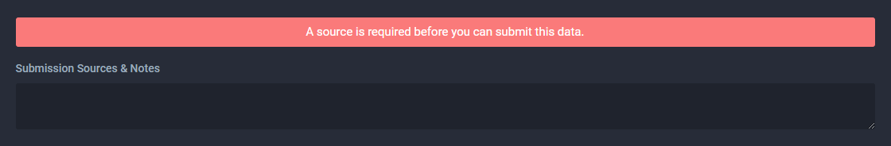

::: tip
Please see the [Websites ](./criteria.html#websites)section for useful sites to help you source information.
:::

#### Information Sourcing Example

_Please note the sources for this example are all Japanese. All the example is for is to help state the value of finding as much information as possible._

I first heard about [Alice-tachi no Hyouhon](https://anilist.co/manga/104652) from seeing the article in Natalie's [new serialization](https://natalie.mu/comic/tag/43) feed. The specific article is [https://natalie.mu/comic/news/304388](https://natalie.mu/comic/news/304388).

This article contains the series title \(アリスたちの標本/Alice-tachi no Hyouhon\), the author's name \(小松万記/Komatsu Maki\), and the names of the main characters \(クララ/Clara and 高垣睦月/Mutsuki Takagaki\). It also mentions the magazine issue containing the first chapter \(週刊漫画TIMES11月2日/Shuukan Manga TIMES 11/02\) went on sale on the day of article posting \(本日10月19日発売/On-sale today, 19th October\). It also provides two images that could possibly be used as a temporary cover or character portraits - the first image also includes the romaji reading of the author's name. The rest of the article is a description of the story.

There are two links below the article, one to the magazine \([https://shukanmanga.jp/](https://shukanmanga.jp/)\), and another to the author's Twitter \([https://twitter.com/kmtmaki](https://twitter.com/kmtmaki)\). Googling the author's name can also often bring up Twitter profiles, blogs, or Wikipedia articles.

The publisher's website has a sub-page for the specific magazine the manga is serialized in \([https://shukanmanga.jp/s\_times/](https://shukanmanga.jp/s_times/)\). Entering the year and month of serialization, 2018/11 for this example, displays issues that mention the series - with the earliest stating the new serialization, color page, and on-sale date.

At the time of writing, a tweet from the author was easily visible referencing the new manga \([https://twitter.com/kmtmaki/status/1051231595129012224](https://twitter.com/kmtmaki/status/1051231595129012224)\). The tweet mentions the on-sale date, magazine and a description of the series. The included image also gives a bit of information about the characters and another option for character portraits. The author's Twitter avatar can also be used for their profile image on AniList, as well as including his Twitter link in their bio.

_Altogether, the links above of the news article, magazine, and authors' Twitter, contain enough information, reinforced between them, to create a decent looking submission._

### Titles

Ensure all titles are used _**officially.**_ Do not use the native title translated into English as the English title.  

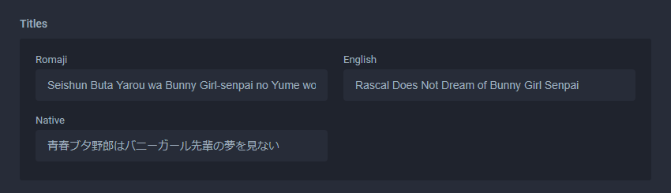

:::tip
Even if the titles are identical, it should still be entered in the respective field. For example, [Sarazanmai](https://anilist.co/anime/101261/Sarazanmai/) has identical Romaji and English names but both fields are filled out.
:::

#### Romaji

The correct [romanization](./criteria.html#japanese-romanization) of the title is preferred over all else and is _**required.**_

::: tip
Please see the [title formatting](./criteria.html#title-modification) section for information on how format titles.
:::

::: warning
Terms like "eiga" and "gekijouban" should be removed from the Romaji name.
:::

#### English

This field should only be filled in with the name given when the entry has been _**officially licensed**_ or is being _**officially streamed**_ in English.

English titles written on the cover or announcement of works \(often as subheadings\) are placed in the ‘[synonym](./submissions.html#synonyms)’ section, as they are not licensed titles.

::: tip
It is acceptable to use the English title when a work is translated into English by legal streaming or reading sites such as [TOPTOON ](https://www.toptoon.net/)\(which is a Chinese service that supplies Chinese, Korean and Japanese works in English, Chinese and Japanese\).

_**However**_, it could be replaced if a native English publisher \(such as Seven Seas, Viz etc.\) later licenses the work, or a publisher of the same native language as the original work \(Example, [TORICO](https://www.torico-corp.com/) is a Japanese publisher that releases Japanese works in English\).
:::

::: tip
Sometimes a work, when released in English, will receive multiple translated titles. In this event the English name of its home release is preferred over a TV or streaming only release. In addition, in the event that multiple home releases exist, whichever is the newest release is the one that should be listed in the English field. Any outdated English names should be included in the synonyms field.
:::

::: warning
English titles created by scanlators or fansubbers are _**not**_ accepted.
:::

#### Native

The official native title.

In almost all cases this will be written in Japanese, Chinese, or Korean. However if the work primarily refers to itself in any other language, then that title should be used rather than the Japanese, Chinese, or Korean subtitle.


### Release Data

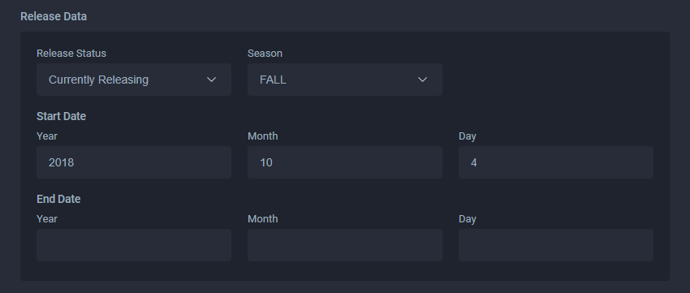

#### Release Status

The current status of the work.

| Status | Description |
| :--- | :--- |
| Finished Releasing | The work has _**finished**_ airing or serialization. |
| Currently Releasing | The work is _**currently**_ airing or in serialization. |
| Not Yet Released | The work _**has yet to**_ air or begin serialization. |
| Canceled | An _**official announcement**_ has been made that the work is canceled. |

#### Season

This will be the season that the anime has aired in and used for the purpose of compiling information for the present and future [AniChart](http://anichart.net). This can be left blank if the airing date has yet to be confirmed.

::: warning
If a series starts release within the final few weeks of a season, it should be pushed forward to the next and be considered an early seasonal release.
:::

::: warning
Seasons should not be applied to music videos, advertisements/commercials, or experimental shorts.
:::

::: warning
Until AniChart has region filtering added, seasons should not be applied to non-Japanese media. Anime co-productions will have seasons applied on a case-by-case basis.
:::

| Season | Period |
| :--- | :--- |
| Winter | January 01 to March 31 |
| Spring | April 01 to June 30 |
| Summer | July 01 to September 30 |
| Fall | October 01 to December 31 |

#### Start Date

The date that the work began airing or began serialization.

If a title releases early but then continues that release in a regular schedule, the start date should reflect that earlier release and the airing episode count should reflect it as well.

If a title was pre-screened at an event, regardless of location, the _**normal**_ broadcast date is to be used.

::: tip
For works such as one-shots, standalone movies, and anthologies, both the start and end date should be set to the same day. This gives it a '_Release Date_' label in the main entry.
:::

::: warning
At times an anime will be announced using a >24 hour clock, such as saying the anime will start airing on July 3rd at 25:15. This typically will mean it is actually airing on July 4th at 1:15 AM, however this can also sometimes mean at July 3rd at 1:15 AM. Conversely they will announce an anime is airing on July 4th at 1:15 AM and that can sometimes mean it will air on July 3rd at 1:15 AM.
:::

#### End Date

The date that the work is confirmed to have finished airing or finished serialization.


### Format

#### Anime

| Format | Description |
| :--- | :--- |
| TV | Anime which have episodes of 15 minutes or more in length and broadcast on television. |
| TV Short | Anime which are under 15 minutes in length and broadcast on television. |
| Movie | Anime that have originally been released at theaters. |
| [Special](./criteria.html#ovas-onas-and-specials) | Specials that have been included in DVD/Blu-ray releases, picture dramas, pilots, etc. |
| [OVA](./criteria.html#ovas-onas-and-specials) \(Original Video Animation\) | Anime that have been released directly on DVD/Blu-ray without originally going through a theatrical release or television broadcast. |
| [ONA](./criteria.html#ovas-onas-and-specials) \(Original Net Animation\) | Anime that have been originally released online or are only available through streaming services. |
| [Music](./criteria.html#music-videos) | Music videos. |

#### Manga

| Format | Description |
| :--- | :--- |
| [Manga](./criteria.html#manga) | Professionally published manga with more than one chapter. |
| [Light Novel](./criteria.html#light-novels) | Light Novels. |
| [One-Shot](./criteria.html#one-shots) | Manga with just one chapter. This includes pilots for manga that were published fully afterward. |

::: warning
[Doujinshi](./criteria.html#doujinshi), [Manhua](./criteria.html#manhua), and [Manwha](./criteria.html#manhwa) are not separate formats on AniList. Instead, you have to the toggle the [Self Published](./submissions.html#self-published) option for doujinshi or change the [Country Of Origin](./submissions.html#country-of-origin) for manhua and manwha.
:::

### Source

Provide the source that the work was adapted from.

The available options are: _**Original, Anime, Manga, Light Novel, Novel, Doujinshi, Visual Novel, Video Game, Other.**_

Like [relations](./submissions.html#relations), sources will almost always all branch off of a single entry.

| Source | Description |
| :--- | :--- |
| Original | The work was not adapted from any other form of media. |
| Anime | The work was adapted from anime. |
| Manga | The work was adapted from manga. |
| Light Novel | The work was adapted from a light novel. |
| Novel | The work was adapted from a novel. |
| Doujinshi | The work was adapted from a doujinshi. |
| Visual Novel | The work was adapted from a visual novel. |
| Video Game | The work was adapted from a video game. |
| Other | The work was adapted from another form of media. |

Example:

> The light novel [Ookami to Koushinryou](https://anilist.co/manga/39115/Ookami-to-Koushinryou/) was the first published release of the series, so it would have the '**Original**' source.
>
> It then has both [anime](https://anilist.co/anime/2966/Ookami-to-Koushinryou/) and [manga](https://anilist.co/manga/33299/Ookami-to-Koushinryou/) adaptations announced. Both of these would be given the '**Light Novel**' source.  
>   
> Any further spin-offs and similar relations would also be sourced to the light novel.

:::warning
Just because earlier released entries are based on a source material, does not mean all subsequently released entries are.
> The movie [Sword Art Online Movie: Ordinal Scale](https://anilist.co/anime/21403/Sword-Art-Online-Movie-Ordinal-Scale/) is a direct sequel to [Sword Art Online II](https://anilist.co/anime/20594/Sword-Art-Online-II/) and a direct prequel to [Sword Art Online: Alicization](https://anilist.co/anime/100182/Sword-Art-Online-Alicization/) however it is not based on any portion of the [Light Novel](https://anilist.co/manga/51479/Sword-Art-Online/) series.
:::

### Country Of Origin

The country that the media was originally published in and is targeted towards. This means OEL \(Original English Language\) series, French comics, etc. are not eligible for the database.

The available options are: _**China, Japan, South Korea, Taiwan**_.

::: warning
Overseas works that are later published by the above four countries do _**not**_ count.

Example:  
Radiant is a French comic later published in Japanese by EUROMANGA.
:::

### Episodes & Duration

The final episode count of the anime. This should be kept blank until an official count has been provided, but can be altered if there are further announcements of episodes within the same series.

#### Episode Duration

Please use the average length \(_**mode**_\) of episodes, rounded to the nearest minute. The 23-25 mark is standard for most TV anime. This can be left blank until a full-length episode has been released.

::: tip
The mean duration can be used for entries with wildly varying lengths, such as [Genius Party](https://anilist.co/anime/3508/GeniusParty). Another way to view this is that if a standard episode length can not accurately be stated for a work, that the work should use the mean for the duration. For an example of such, consider [Princess Tutu](https://anilist.co/anime/721/Princess-Tutu/). Works with low episode counts with episodes that vary in length will typically use the mean episode length.
:::

::: tip
In the event that a series has some episode of different length, but not enough to satisfy using the mean, a note should be added to the description explaining the duration of the exception and which episode it was, such as [Hibike! Euphonium 2](https://anilist.co/anime/21460/Hibike-Euphonium-2/).
:::

### Chapters & Volumes

The total number of chapters in the first edition of the physical volumes. Or, if volumes were never printed, the total number of chapters in the magazine/site the work was in. This does include things such as ‘side’ chapters \(Example: Chapter 5.5\), bonus chapters, and some prologues and epilogues.

This excludes special pages for things such as advertising volume releases or author comments.

Volume and chapter counts are only added when the work is completed or confirmed complete. if the work is still publishing, both remain at _**zero**_.

One-Shots should have the chapter count as _**one**_ and the volume count left as _**zero**_.

::: tip
Bonus chapters are often referred as 番外編 \(_Bangaihen_\) and 書き下ろし \(_Kakioroshi_\) in the table of contents.
:::

#### Volumes

The total number of volumes in the _**original**_ print or eBook run of the work.

::: warning
The use of ‘original’ above is due to the fact that series can have new editions printed, omnibus volumes if licensed, etc. These can have different counts than the original runs.
:::

::: warning
If a specific manhwa or manhua title goes by 'seasons', the volume count must remain at _**zero**_. Instead, add the seasons and the amount of chapters it contains in the entry description.
:::

### Genres

List any relevant genres to the entry, always try to include at least two or three, but don’t force them if they’re not strictly relevant. They do not need to be overly prominent but you should be able to come to a decision on whether it is suitable.

#### List of Genres

|  |  |
| :--- | :--- |
| Action | Music |
| Adventure | Mystery |
| Comedy | Psychological |
| Drama | Romance |
| Ecchi | Sci-Fi |
| Fantasy | Slice of Life |
| Hentai | Sports |
| Horror | Supernatural |
| Mahou Shoujo | Thriller |
| Mecha |  |

### Synonyms

Official alternative titles for the work. These can be alternative licensed titles, shortened versions of the title, or subheadings shown on the advertising or cover.

#### Examples

Example 1:

> The series [Watashi ga Motenai no wa Dou Kangaete mo Omaera ga Warui!](https://anilist.co/anime/16742/Watashi-ga-Motenai-no-wa-Dou-Kangaetemo-Omaera-ga-Warui/) has the synonym of ‘Watamote’.

Example 2:

> The manga [Shoujo no Skirt wa Yoku Yureru](https://anilist.co/manga/104035/Shoujo-no-Skirt-wa-Yoku-Yureru/) is also advertised alongside the subtitle 'Girls Skirts Fluttering in the Wind'. As the work is not licensed, this remains in Synonyms and _**not**_ the English title field.

::: warning
Please be aware that titles created by fansubbers or scanlators are normally not allowed unless widespread in common use.
:::

### Description

A basic, spoiler-free description of the entry. This should be in English and a source provided \(whether taken from another site or written by yourself\).

::: tip
Descriptions use HTML.  
Please use &lt;br&gt; for line breaks.  
Links can be added as so: &lt;a href="website"&gt;NAME&lt;/a&gt;
:::

::: warning
Do not source piracy sites for manga. Instead, look for a legal alternative, such as the official English licensor \(Example: Kodansha Comics\) or another English database \(Example: MangaUpdates\). 

If no other alternative appears, use _\(Source: Japanese Publisher, translated\)_ or any equivalent of it.
:::

#### Formatting Best Practices

**1\) HTML Code**

&lt;br&gt; is for line break. _**Always**_ use this whenever there is a line break.

Example:

> Mari's girlfriend, Arisa, loses her memories of the past three years, including all memory of their life together. However, it turns out that being crazy in love with someone transcends all realms of possibility.&lt;br&gt;  
> &lt;br&gt;  
> \(Source: Girls in Boxes\)

Will produce:

> Mari's girlfriend, Arisa, loses her memories of the past three years, including all memory of their life together. However, it turns out that being crazy in love with someone transcends all realms of possibility.  
>   
>   <br>
> (Source: Girls in Boxes)

::: tip
&lt;b&gt; and &lt;i&gt; are for **bold** and _italic_**,** \_\_but don't forget to use &lt;/b&gt; or &lt;/i&gt; at the end of the text you want to format.
:::

**2\) If the entry includes one-shots, use:**

> &lt;b&gt;Included one-shot:&lt;/b&gt; Romaji Title \(Translated Title \(if available\)\).

It should be placed at the bottom of the description.

Example:[ ](https://anilist.co/manga/87146) [Mayoke no Darling](https://anilist.co/manga/87146)  
Example if the manga has multiple volumes:[ ](https://anilist.co/manga/69291) [Nijiiro Days](https://anilist.co/manga/69291)

::: warning
Don't forget to put the one-shot names in the synonyms.
:::

**3\) For compilations or anthologies, enter:**

> Chapter Number. &lt;b&gt;Romaji Title&lt;/b&gt; \(Kanji, Translation\); Magazine \(dated\)

Example:

> 6-9. Imouto☆Control \(いもうと☆こんとろーる\); Comic Megastore 2011-10, 2012-02, 07, kakioroshi

This means it's chapter 6-9 on that compilation manga.

Example Compilation:[ ](https://anilist.co/manga/92817) [Hatsukoi Ribbon](https://anilist.co/manga/92817)  
Example Anthology:[ ](https://anilist.co/manga/45515) [Gunjou Gakusha](https://anilist.co/manga/45515)

**4\) Use italics if the description mentions the work.**

> _Bakuman_ follows the story of high school student Moritaka Mashiro**...**

Example:[ ](https://anilist.co/manga/39711) [Bakuman](https://anilist.co/manga/39711)

### YouTube Preview ID

Only _**official**_ videos by a rights-holder will be accepted, while this can be a CM, a PV is preferred when possible.

::: tip
If the video has been region-locked, then [YouTube](https://www.youtube.com/) re-uploads or [Dailymotion](https://www.dailymotion.com/) uploads are accepted.
:::

The ID is located at the end of the [YouTube](https://www.youtube.com/) video URL.

For example, the ID for [https://www.YouTube.com/watch?v=fq3abPnEEGE](https://www.youtube.com/watch?v=fq3abPnEEGE) is `fq3abPnEEGE`  
To add a [Dailymotion](https://www.dailymotion.com/gb) video, prefix the [Dailymotion](https://www.dailymotion.com/gb) video ID with `dm--`

### Twitter Hashtag

The official hashtag used by the studio or [Twitter](http://twitter.com) account for the anime. Include the \# sign.

Multiple tags can be included by having a space between each tag, and the link on the entry page will include all hashtags separated by an ‘OR’ gate.  
\(Example: '_\#三ツ星カラーズ \#カラーズ_' will direct the user to '[_\#三ツ星カラーズ OR \#カラーズ_](https://twitter.com/search?q=%23三ツ星カラーズ%20OR%20%23カラーズ&src=typd)'\)-

### MyAnimeList ID

The ID number for the entry as per [MyAnimeList](https://myanimelist.net/). This can be found at the end of the URL.

For example, the first _City Hunter_ anime has the URL [http://myanimelist.net/anime/1470](http://myanimelist.net/anime/1470), with the ID being _**1470**_. Please make sure you are linking the _**correct**_ anime or manga ID as this is used to accurately import lists.

::: warning
Please _**don’t**_ add a [MyAnimeList](https://myanimelist.net/) ID if the entry is _**unapproved**_. You can normally spot unapproved entries as they will be on zero user lists you'll receive a warning message if you try to add one to your own list.

Each submission to MyAnimeList generates its own ID, so it’s possible that the ID for the entry submitted to [AniList](https://anilist.co) will _**not**_ be the ID of the entry that MyAnimeList later approves, as some series will have multiple unapproved versions on the website.

Incorrect IDs mean users using the import feature will receive an error or incorrect entry. Unfortunately, MyAnimeList can often take a long time to approve works \(more so for manga\), as such you may not be able to link entries for a while.
:::

::: warning
In the event that AniList has an entry split into multiple parts but MyAnimeList has it as a single entry, such as [Aikatsu](https://myanimelist.net/anime/15061/Aikatsu), whereas AniList has it as multiple entries ([1](https://anilist.co/anime/15061/Aikatsu/), [2](https://anilist.co/anime/20181/Aikatsu-2/), [3](https://anilist.co/anime/20794/Aikatsu-3/), [4](https://anilist.co/anime/21307/Aikatsu-4/)) the ID should only be attached to the first entry.
:::

### Self Published

This is unchecked by default, and should _**only**_ be checked if the work is a [doujinshi](./criteria.html#doujinshi).

### Adult

It is _**important**_ that you check this for any 18+ releases or pornographic works \(hentai\). This is used to filter adult anime if a user has disabled 18+ mode on their profile.

Works that feature sexual content as plot devices or for fan service without it being the central focus of the series should not be marked as adult. For example, series like [Yosuga no Sora](https://anilist.co/anime/8861) and [Shinmai Maou no Testament](https://anilist.co/anime/20678) are _**not**_ marked as adult.

However, other series with strong sexual content such as BL \(Boys’ Love\) and josei focused manga and anime like [Rent Boy](https://anilist.co/manga/101416) or [Skirt no Naka wa Kedamono Deshita](https://anilist.co/anime/98790) should be marked as adult. Although they don’t fit the typical western definition of hentai, the intent behind them is enough to consider them pornographic.

::: tip
If you’re unsure whether or not a series should or should not be marked as adult, feel free to ask in the [Discord](https://discord.gg/TF428cr) and/or ping one of the hentai moderators.
:::

### Locked

A lock check will disable the option to add the locked entry to lists or favorites and append ‘\(Locked\)’ to the title. This should only be used for entries that are to be later removed.

::: warning
This feature is not available to standard users.
:::

### Forum Thread

This will create automated threads in the Release Discussion section of the forum 24 hours after a new episode of an airing anime being released. This can be used at your own discretion as to whether you feel that relevant discussion will be generated on the thread. Excessive use could cause a high amount of empty threads.

::: tip
Users may also wish to create their own threads and it can be disabled for this purpose. If the option is enabled, a post will not be made if one has already been created by a user.
:::

::: warning
This feature is not available to standard users.
:::

## Images


### Cover

This is the cover image for the entry. A cover is _**required**_.

Only official artwork or assets should be used, and the piece should be from the native release. This means no use of covers with translations unless there _**REALLY**_ is not anything else.

Examples of good covers can be seen at the bottom of this section.

::: tip
Please refer to the [Image Dimensions and Templates](./criteria.html#image-dimensions-and-templates) section for additional information on recommended sizes, if required..
:::

::: warning
Images should not have borders around the artwork. Crop them out when required.
:::

::: danger
Pornographic works should have appropriate censoring of the genitals and visible breasts.
:::

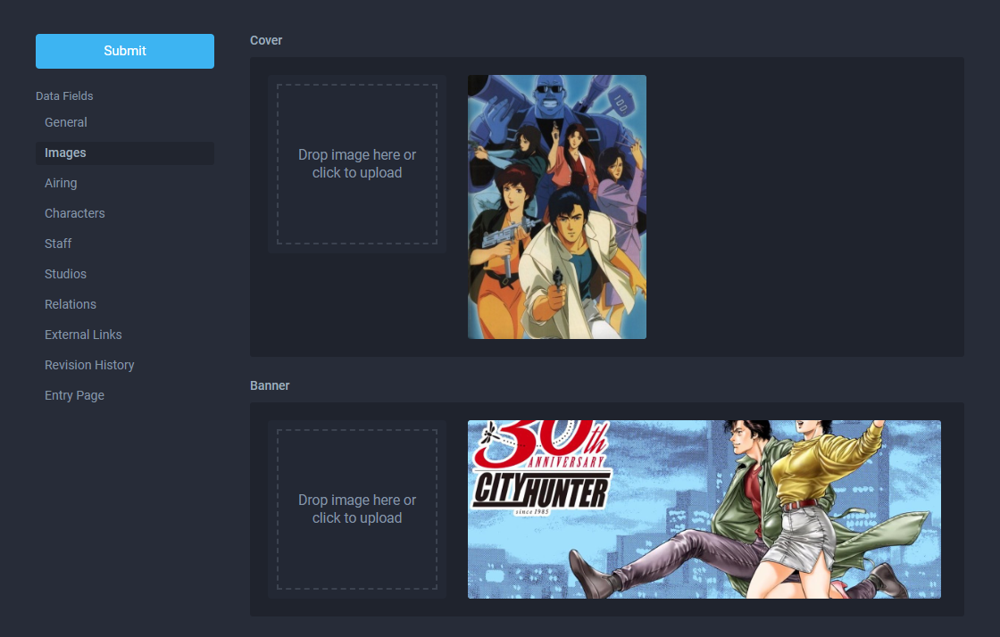

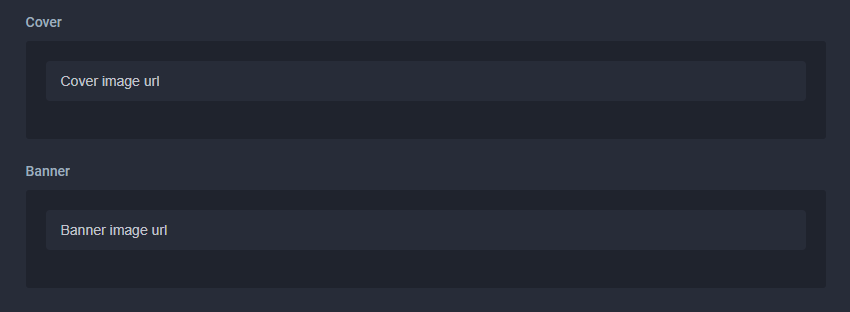

::: tip
Local image upload is currently available to moderators only.
:::

#### Animated Media

For anime, the cover can be a key visual, announcement piece for a new anime, a textless VHS/DVD/BD cover, official illustration, and, in cases where nothing decent is available, a screenshot or cropped piece from the work itself.

#### Written Media

For manga and light novels, where possible, the cover image must be the _**Volume 1**_ release of the original print run for the series.

For series that are web-only or have yet to receive a printed volume or eBook, the cover can be announcement pieces or official illustrations.

If nothing else is available, the first page of the series itself will do \(many one-shots will have this\).

::: warning
Please don't crop volume covers for written media _**unless**_ removing spines or borders. It is fine to upload them directly.
:::

Spine Example:

:::: tabs :options="{ useUrlFragment: false }"
::: tab "Uncropped Spine"
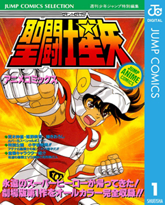
:::

::: tab "Cropped Spine"
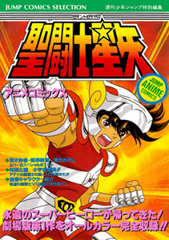
:::
::::

#### Animated Media Examples:

:::: tabs :options="{ useUrlFragment: false }"
::: tab "Illustration"
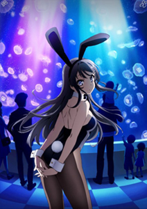

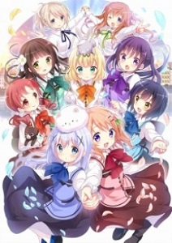
:::

::: tab "Announcement"


:::

::: tab "Frame"
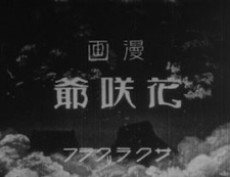

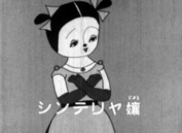
:::
::::

#### Written Media Examples:

:::: tabs :options="{ useUrlFragment: false }"
::: tab "Volume 1"
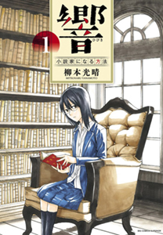

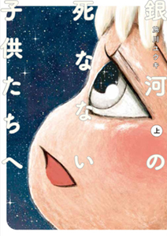
:::

::: tab "One-Shot"
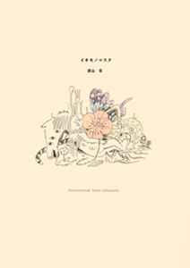

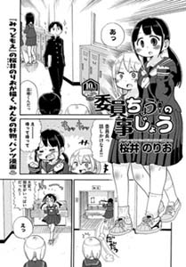
:::

::: tab "Announcement"
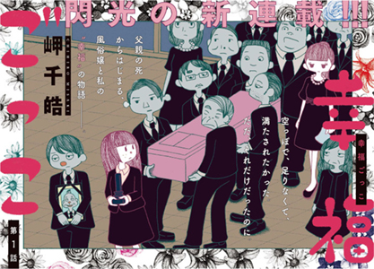


:::

::: tab "Illustration"


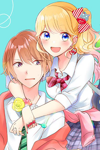
:::
::::


### Banner

A suitable image to use as the header banner in the entry for the anime. As with cover images, this should be _**official**_ artwork or assets only. The image should be of decent quality and not too gaudy, it is up to yourself what you think would look good as a banner.

The image should ideally be cropped to _1900x400px_ and either .jpg \(.jpeg\) or .png format. However .png banners will be converted to .jpg \(.jpeg\) for storage.

::: tip
Please refer to [Image Dimensions and Templates](./criteria.html#image-dimensions-and-templates), if required.
:::

#### Good Banners
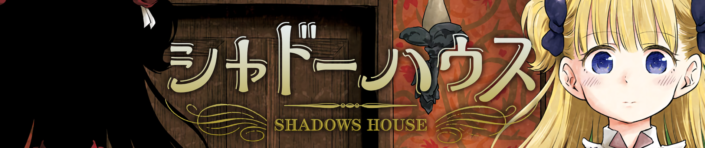

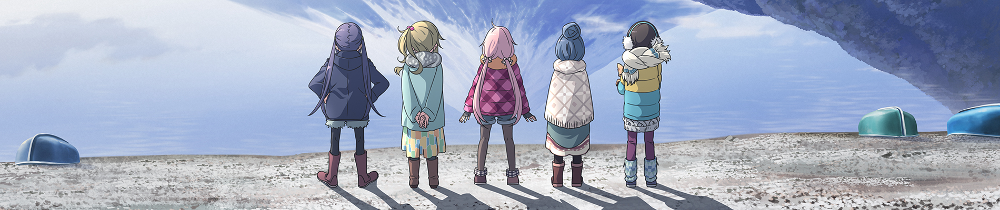

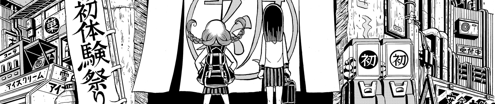


## Airing

### Calendar

The airing page will allow a moderator to modify the airing schedule for an anime. This controls the countdown until the next episode and what episode an anime is going to release next. While the initial schedule should be generated by clicking the "Generate New Schedule" button, if a modification is needed (such as an anime taking a break for the week) you can simply click on the calendar view to remove that day from the schedule.

::: warning
Adding dates using the calendar should only be done to add past dates to fix the episode count. If you add a date using the calendar that has not yet occurred, it will not use the specified airing time used when generating the schedule.
:::

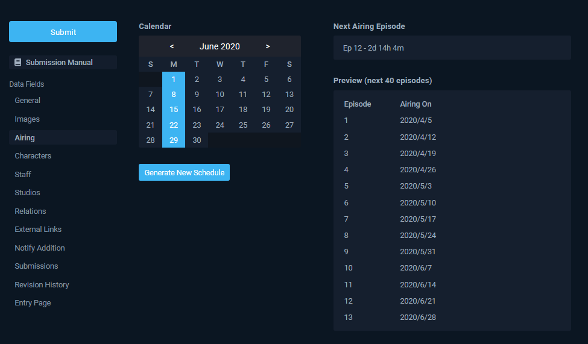

#### Schedule Generator

The schedule generator allows you to automatically generate a schedule for however many episodes the anime is listed for. The airing time should always be set to Japan Standard Time (JST). The days between episodes is typically 7 and unless otherwise stated, a newly airing show can have its schedule set to 12 episodes until an episode count is known. When creating a schedule for the first time the "Start generating at episode #" should be left at 1. 

::: tip
If you need to fix or generate a new schedule for a longer running anime, such as [Meitantei Conan](https://anilist.co/anime/235/Meitantei-Conan/) you will need to adjust the episode # to start at appropriately. The starting episode date should also be modified to reflect the airing date of the "start generating at episode #" episode you had selected.
:::

::: tip
If an anime releases multiple episodes at one time, in order to correct the "next airing episode" you can click on past dates in the calender which will bump up the next airing episode number accordingly.
:::

::: warning
At times an anime will be announced using a >24 hour clock, such as saying the anime will start airing on July 3rd at 25:15. This typically will mean it is actually airing on July 4th at 1:15 AM, however this can also sometimes mean at July 3rd at 1:15 AM. Conversely they will announce an anime is airing on July 4th at 1:15 AM and that can sometimes mean it will air on July 3rd at 1:15 AM.
:::


### Next Airing Episode

The next airing episode area displays when the next episode is set to air according to the schedule and what episode # that will be. Please always check this before submitting a change to the schedule.

### Preview

The preview area is similar to next airing episode area, however it allows a moderator to check that airing dates have been set up correctly.

## Characters

### Adding Characters

The characters page will let you manage the characters that feature in the work. Adding existing characters, creating new characters, and assigning their roles and voice actors are all done here.

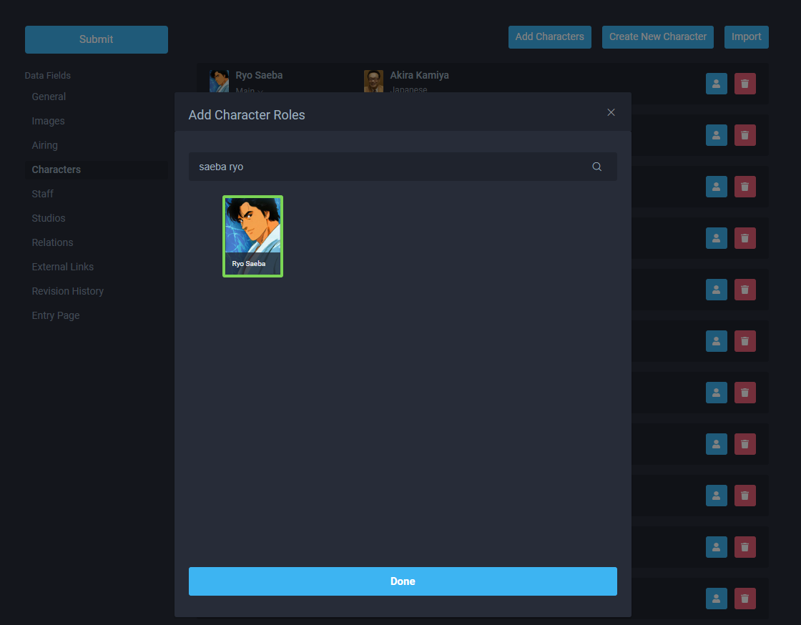

#### Add Characters

The popup after pressing the ‘_Add Characters_’ button will let you search for the character you want to link, which you can then select and confirm. Back on the main page, you’ll now be able to add a role and voice actor.

::: tip
Multiple characters can be selected at once. You are also able to search for a new name and continue selecting characters. Everything will be carried over when '**Done**' is pressed.
:::

::: warning
A singular [narrator](https://anilist.co/character/36309) character is used for all narrator roles in which the narrator does not have a physical apperance in the work. 
:::

#### Character Role

Each character has the option to be set as a _main_, _supporting_, or _background_ character. For many of these, it will be up to your own judgment.

### Create New Characters

#### Given Name

Their given name\(s\) in correct [romanization](./criteria.html#japanese-romanization).

#### Surname

Their surname or alias in correct romanization.

#### Native Name

For native names, the order should be ‘_**Surname Given Name**_’ without spaces.

Example:

> [Eriko Kimura](https://anilist.co/staff/105138/Eriko-Kimura)’s native name field should be '木村絵理子' \(KimuraEriko\).
>
> A lot of current entries are incorrectly written as '絵理子木村' \(ErikoKimura\), which is the wrong way round, or '木村 絵理子' \(Kimura Eriko\), which contains a space. So, if you see it, please try to correct it.

::: tip
[Dictionary browser extensions](./criteria.html#tools) can help with kanji readings if you know hiragana. if not, then feel free to ask for help in [Discord](https://discord.gg/TF428cr).
:::

An exception to the above is when a name is natively western.

Example:

> ‘[Reinhard von Lohengramm](https://anilist.co/character/3066/Reinhard-von-Lohengramm)’ would be written as _ラインハルト・フォン・ローグラム_. Keep in mind the rules of the language the name is born from, as terms like '_von'_ and '_van_' in German would be tacked onto the start of the surname.
>
> Additionally, any middle names should be placed at the end of the given name.

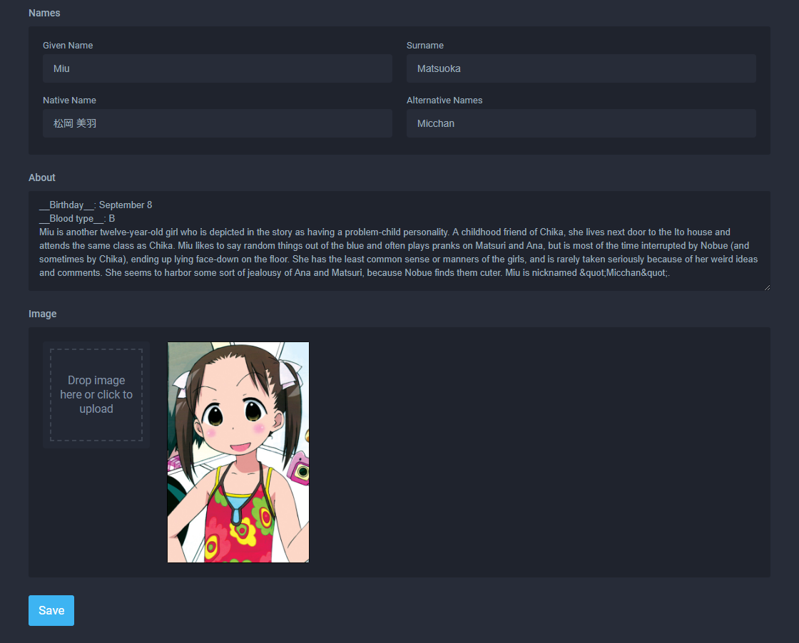

#### Alternative Names

Any alternative names that the character is known by, _**excluding spoilers**_. Example: [Ryo Saeba](https://anilist.co/character/2065/Ryo-Saeba) from the series [City Hunter](https://anilist.co/anime/1470/City-Hunter/) is known as _City Hunter_ by some characters.

#### About

A basic description. It should be spoiler free \(or contain spoiler tags\) and contain basic information on the character. This can be hobbies, birthday, and qualities, to a background introduction.  
Example: [Akari Mizunashi](https://anilist.co/character/378)

#### Image

This is the cover image for the character.

A clean headshot or head and shoulders portrait should be used where possible. There is no preference for designs if a character has appeared in various media formats.

Format should either .jpg \(.jpeg\) or .png

::: danger
A character's image should _**not**_ be a spoiler for the work.  
Example: A character transforms into something else in a way that would be considered a plot spoiler.
:::

::: warning
Covers should be as close a 2:3 ratio as possible.

If you have to crop or create new images then 230x345px is the recommended minimum. Larger images will be downscaled to 230px width.

Please refer to [Image Dimensions and Templates](./criteria.html#image-dimensions-and-templates), if required.
:::

::: tip
Local image upload is currently available to moderators only.
:::

#### Image Examples

:::: tabs :options="{ useUrlFragment: false }"
::: tab "Good Images"
|  |  |
| :--- | :--- |
| 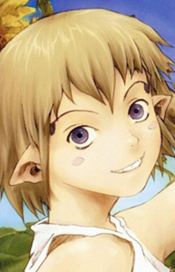 | 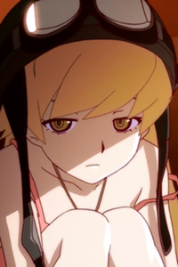 |
|  | 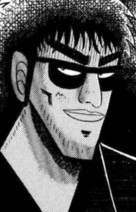 |
| 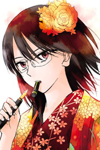 | 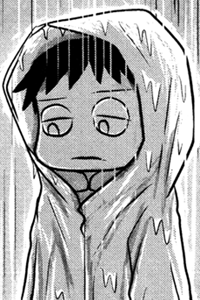 |
|  |  |
:::

::: tab "Bad Images"
|  |  |
| :--- | :--- |
| 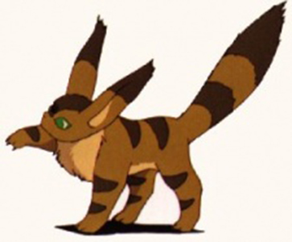 |  |
| 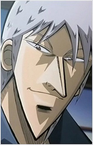 | 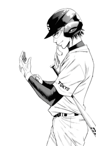 |
|  | 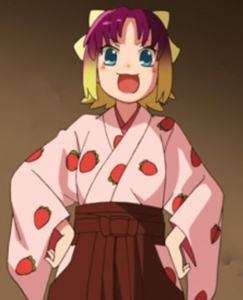 |
:::
::::

### Create New Voice Actor

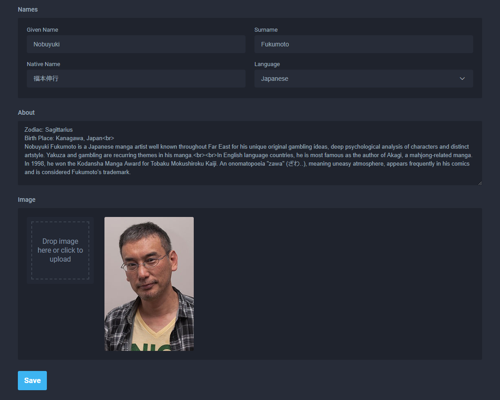

#### Given Name

Their given name\(s\) in correct [romanization](./criteria.html#japanese-romanization).

#### Surname

Their surname or alias in correct romanization.

#### Native Name

For native names, the order should be ‘_**Surname Given Name**_’ without spaces.

Example:

> [Eriko Kimura](https://anilist.co/staff/105138/Eriko-Kimura)’s native name field should be '木村絵理子' \(KimuraEriko\).
>
> A lot of current entries are incorrectly written as '絵理子木村' \(ErikoKimura\), which is the wrong way round, or '木村 絵理子' \(Kimura Eriko\), which contains a space. So, if you see it, please try to correct it.

::: tip
[Dictionary browser extensions](./criteria.html#tools) can help with kanji readings if you know hiragana. if not, then feel free to ask for help in [Discord](https://discord.gg/TF428cr).
:::

An exception to the above is when a name is natively western.

Example:

> ‘[Reinhard von Lohengramm](https://anilist.co/character/3066/Reinhard-von-Lohengramm)’ would be written as _ラインハルト・フォン・ローグラム_. Keep in mind the rules of the language the name is born from, as terms like '_von'_ and '_van_' in German would be tacked onto the start of the surname.  
>   
> Additionally, any middle names should be placed at the end of the given name.

#### Language

The language that the staff member performs or works in. This is currently only used and displayed for Voice Actor language.

#### About

A basic description of the person, it can be hometown, birthday, hobbies and interests, social media links, blogs etc.  
Example: [Tatari Takayama](https://anilist.co/staff/128291/Tatari-Takayama)

#### Image

This is the cover image for the voice actor.

A clean headshot or head and shoulders portrait photo should be used where possible.

Format should either .jpg \(.jpeg\) or .png.

::: warning
Covers should be as close a 2:3 ratio as possible.

If you have to crop or create new images then 230x345px is the recommended minimum. Larger images will be downscaled to 230px width.

Please refer to [Image Dimensions and Templates](./criteria.html#image-dimensions-and-templates), if required.
:::

::: tip
For many staff, images such as Twitter, Pixiv, or personal blog avatars can be suitable replacements if a photo portrait doesn’t exist. Cropping these isn’t required  
Example: [Yamakawa Naoto](https://anilist.co/staff/105479/Naoto-Yamakawa), [Takayama Tatari](https://anilist.co/staff/128291/Tatari-Takayama)
:::

::: tip
Local image upload is currently available to moderators only.
:::

:::: tabs :options="{ useUrlFragment: false }"
::: tab "Good Images"
|  |  |
| :--- | :--- |
|  |  |
|  |  |
| 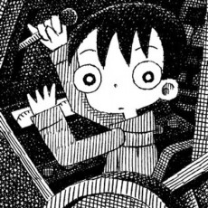 |  |
:::

::: tab "Bad Images"
|  |  |
| :--- | :--- |
|  |  |
:::
::::

### Add/Edit Voice Actor Role

The popup after pressing the ‘_Voice Actor_’ button will let you search for the staff member you want to link to the character, which you can then select and confirm.

::: tip
The language is set on the staff page itself, so if you are adding voice actors for multiple languages, you will need to add the same character again, then add each additional voice actor to the respective duplicate.  
Example: [Tonari no Totoro](https://anilist.co/anime/523)
:::

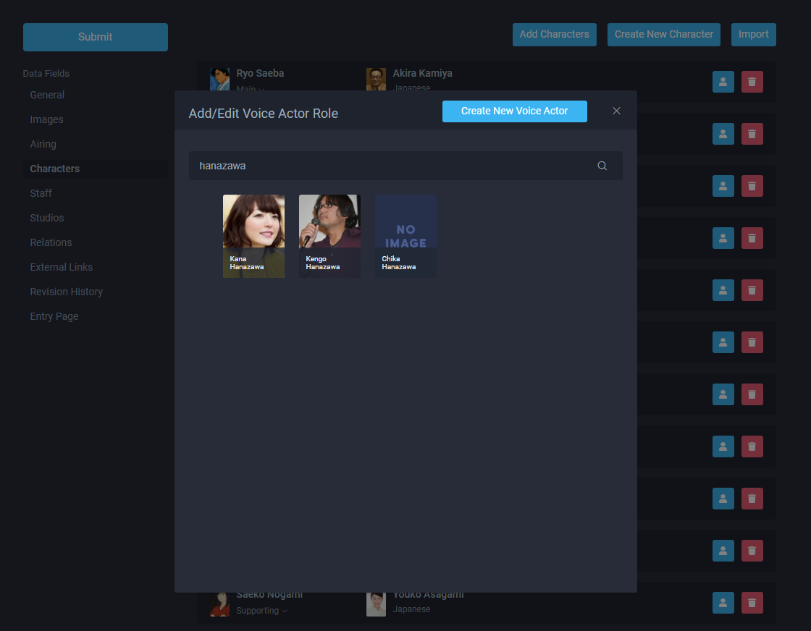


## Staff

### Adding Staff

The staff page will let you manage the people that were involved in creating the work. Adding existing staff, creating new staff, and assigning their roles are all done here.

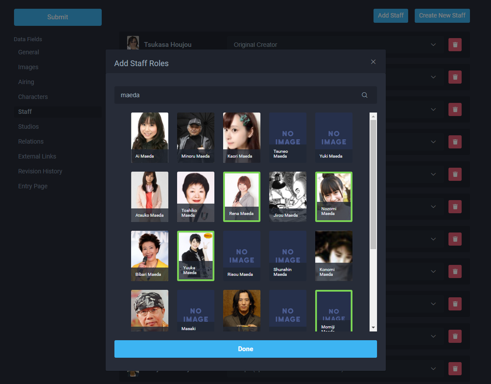

#### Add Staff

The popup after pressing the ‘_Add Staff_’ button will let you search for the staff member you want to link, which you can then select and confirm. Back on the main page, you’ll now be able to add a role.

::: tip
Multiple staff can be selected at once. You are also able to search for a new name and continue selecting characters. Everything will be carried over when '**Done**' is pressed.
:::

### Create New Staff


#### Given Name

Their given name\(s\) in correct [romanization](./criteria.html#japanese-romanization).

#### Surname

Their surname or alias in correct romanization.

#### Native Name

For native names, the order should be ‘_**Surname Given Name**_’ without spaces.

Example:

> [Eriko Kimura](https://anilist.co/staff/105138/Eriko-Kimura)’s native name field should be '木村絵理子' \(KimuraEriko\).
>
> A lot of current entries are incorrectly written as '絵理子木村' \(ErikoKimura\), which is the wrong way round, or '木村 絵理子' \(Kimura Eriko\), which contains a space. So, if you see it, please try to correct it.

::: tip
[Dictionary browser extensions](./criteria.html#tools) can help with kanji readings if you know hiragana. if not, then feel free to ask for help in [Discord](https://discord.gg/TF428cr).
:::

An exception to the above is when a name is natively western.

Example:

> ‘[Reinhard von Lohengramm](https://anilist.co/character/3066/Reinhard-von-Lohengramm)’ would be written as _ラインハルト・フォン・ローグラム_. Keep in mind the rules of the language the name is born from, as terms like '_von'_ and '_van_' in German would be tacked onto the start of the surname.  
>   
> Additionally, any middle names should be placed at the end of the given name.

#### Language

The language that the staff member performs or works in. This is currently only used and displayed for Voice Actor language.

#### About

A basic description of the person, it can be hometown, birthday, hobbies and interests, social media links, blogs etc.  
Example: [Rie Takahashi](https://anilist.co/staff/119331/Rie-Takahashi)

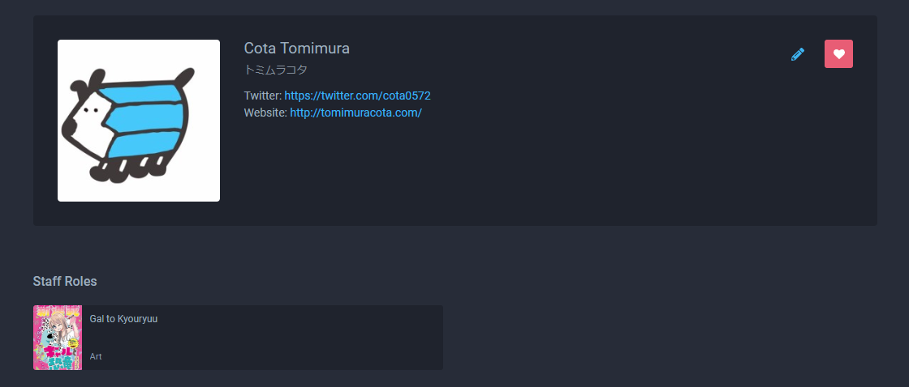

#### Image

This is the cover image for the staff member.

A clean headshot or head and shoulders portrait photo should be used where possible.

Format should either .jpg \(.jpeg\) or .png.

::: warning
Covers should be as close a 2:3 ratio as possible.

If you have to crop or create new images then 230x345px is the recommended minimum. Larger images will be downscaled to 230px width.

Please refer to [Image Dimensions and Templates](./criteria.html#image-dimensions-and-templates), if required.
:::

::: tip
For many staff, images such as Twitter, Pixiv, or personal blog avatars can be suitable replacements if a photo portrait doesn’t exist. Cropping these isn’t required

Example: [Yamakawa Naoto](https://anilist.co/staff/105479/Naoto-Yamakawa), [Takayama Tatari](https://anilist.co/staff/128291/Tatari-Takayama)
:::

::: tip
Local image upload is currently available to moderators only.
:::

:::: tabs :options="{ useUrlFragment: false }"
::: tab "Good Images"
|  |  |
| :--- | :--- |
|  |  |
|  |  |
|  |  |
:::

::: tab "Bad Images"
|  |  |
| :--- | :--- |
|  |  |
:::
::::

### Staff Role

Choose the role that the staff member had in the work. If the staff member had multiple roles, you will need to add the staff member themselves multiple times.

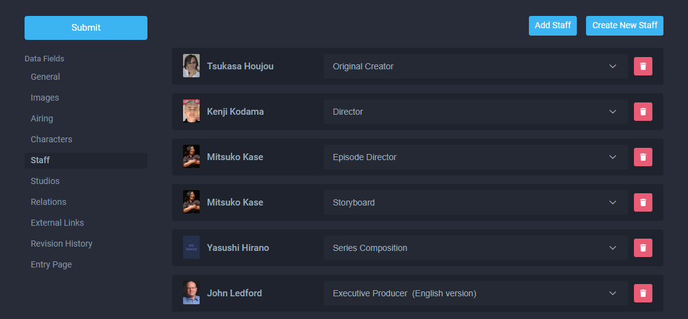

#### **Anime**

In terms of anime, for staff, if they have specific episode credits, they should be credited in the following formats; _**‘Storyboard \(ep 5\)**_’ or ‘_**2nd Key Animation \(eps 1, 3, 8, 11, 13\)**_’ with a comma, followed by a space after every episode number. If they are credited with a studio next to their name, do not include the studio. If they are credited for at least 3 consecutive episodes then it should be formatted as ‘_**Animation Director \(eps 7-9\)**_’. For insert songs, the name of the song should only be used in the event that a single episode has multiple insert songs such as ‘_**Insert Song Performance \("Song Name"; eps 7-9\)**_’, otherwise it should be formatted as ‘_**Insert Song Performance \(eps 7-9\)**_’.

::: warning
Keep in mind that some titles do not follow conventional episode credits \([Panty & Stocking with Garterbelt](https://anilist.co/anime/8795/Panty--Stocking-with-Garterbelt/) or [Princess Tutu](https://anilist.co/anime/721/Princess-Tutu/) are both good examples\). Care should be taken to convert episode credits into how [AniList ](http://anilist.co)lists episodes.

For example, [Princess Tutu](https://anilist.co/anime/721/Princess-Tutu/) is often credited as if it were a 26 episode anime but [AniList ](http://anilist.co)lists it as 38 as episodes. Episodes 14 to 37 were aired as 12 minute long episodes. A credit of ‘_**In-Between Check \(ep 26\)**_’ elsewhere might be ‘In-Between Check \(ep 38\)’ on [AniList](http://anilist.co), you’ll need to determine the convention used on the site you’re pulling the data from. Conversely, for a title like [Panty & Stocking with Garterbelt](https://anilist.co/anime/8795/Panty--Stocking-with-Garterbelt/), a credit for ‘_**Episode Director \(ep 2\)**_’ would be ‘_**Episode Director \(ep 1b\)**_’.
:::

#### Manga

In terms of manga, for staff, credit writers with '_**Story'**_ and illustrators with '_**Art'**_. If a creator is both, credit them with '_**Story and Art'**_.

::: warning
For spin-offs and related works undertaken by other authors and artists, you will need to use the _**Original Work**_ or _**Character Design**_ roles. This will almost always apply to anime adaptations.

\(Example: [Chuukan Kanriroku Tonegawa](https://anilist.co/manga/95339/Chuukan-Kanriroku-Tonegawa/)\)
:::


## Studios

#### Add Studios

This popup will allow you to search for and add existing studios to the work.

#### Create New Studio

This popup will allow you to create a new studio to be added to the work. Presently, the only information stored and required is the Studio’s name. Refer to the guide at the start of the manual for correct [romanization](./criteria.html#japanese-romanization), if required.

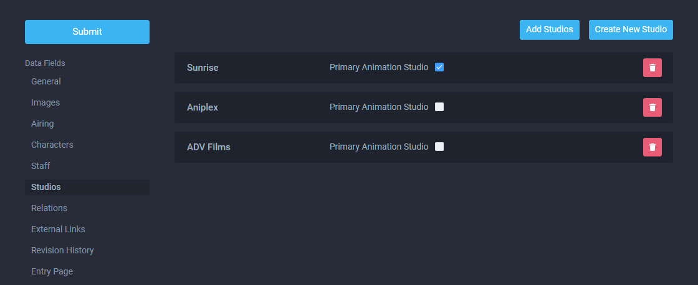


## Relations

This section allows you to set the relation of works compared to others in the same series or universe.

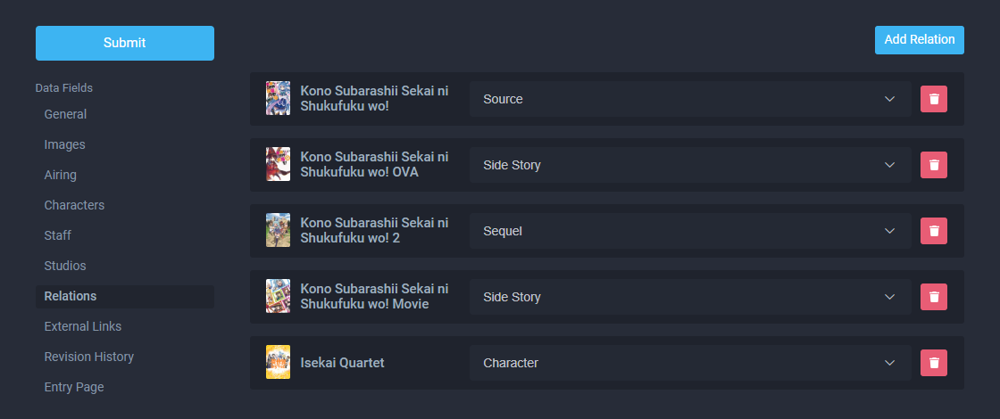

::: warning
Relations should be in _**chronological**_ order.  
Examples: [Bakemonogatari](http://anilist.co/anime/5081/Bakemonogatari), [Fate Stay/Night](https://anilist.co/anime/356/Fatestay-night/)
:::

#### Opposite Relations

When a _prequel, sequel, alternative, character, compilation, contains, source, or adaptation_ relation is added, the corresponding reverse relation will be automatically added to the affected entry.

Example 1 \(Adaptations\):

> The light novel [Kono Subarashii Sekai ni Shukufuku wo!](https://anilist.co/manga/86238/Kono-Subarashii-Sekai-ni-Shukufuku-wo/) was announced to have both [manga](https://anilist.co/manga/85702/Kono-Subarashii-Sekai-ni-Shukufuku-wo/) and [anime](https://anilist.co/anime/21202/Kono-Subarashii-Sekai-ni-Shukufuku-wo/) adaptations:
> 
> Adding the [novel](https://anilist.co/manga/86238/Kono-Subarashii-Sekai-ni-Shukufuku-wo/) as the '**source**' to both the [manga](https://anilist.co/manga/85702/Kono-Subarashii-Sekai-ni-Shukufuku-wo/) and [anime](https://anilist.co/anime/21202/Kono-Subarashii-Sekai-ni-Shukufuku-wo/) automatically adds the [manga](https://anilist.co/manga/85702/Kono-Subarashii-Sekai-ni-Shukufuku-wo/) and [anime](https://anilist.co/anime/21202/Kono-Subarashii-Sekai-ni-Shukufuku-wo/) as the '**adaptation**' to the [novel](https://anilist.co/manga/86238/Kono-Subarashii-Sekai-ni-Shukufuku-wo/), and vice versa.

::: warning
If a work that isn't eligible to be on the website, such as a full novel, receives multiple adaptations \(such as anime, manga etc.\). They would be linked through the **alternative** relation.
:::

Example 2 \(Sequels\):

> The anime [City Hunter](https://anilist.co/anime/1470/City-Hunter/) had a second season released:  
>   
> Adding [City Hunter 2](https://anilist.co/anime/1471/City-Hunter-2/) as the '**sequel'** to [City Hunter](https://anilist.co/anime/1470/City-Hunter/) automatically adds [City Hunter](https://anilist.co/anime/1470/City-Hunter/) as the '**prequel'** to [City Hunter 2](https://anilist.co/anime/1471/City-Hunter-2/), and vice versa.

Example 3 \(Compilations\):

> The now-defunct magazine, _Pure Yuri Anthology Hirari_, which solely published one-shots, released an anthology containing a selection of six of their one-shots:
>
> Adding [Isshun no Asterism](https://anilist.co/manga/104980) \(_one-shot_\) to [Shuuden ni wa Kaeshimasu](https://anilist.co/manga/85662/Shuuden-ni-wa-Kaeshimasu/) \(_anthology_\) with the '**contains'** relation automatically adds [Shuuden ni wa Kaeshimasu](https://anilist.co/manga/85662/Shuuden-ni-wa-Kaeshimasu/) as the '**compilation'** to [Isshun no Asterism](https://anilist.co/manga/104980), and vice versa.

#### Parent Relations

When updating all other relations \(_spin off, side story, character, summary,_ etc.\) you have to do so from the '**parent'** entry. The parent relation will then be created on the other entry as the opposite.

Example:

> The light novel [Kono Subarashii Sekai ni Shukufuku wo!](https://anilist.co/manga/86238/) had the manga spin-off [Kono Subarashii Sekai ni Bakuen wo!](https://anilist.co/manga/100147/Kono-Subarashii-Sekai-ni-Bakuen-wo/) announced:
>
> To link the entries, you must be in the light novel entry and set [Kono Subarashii Sekai ni Bakuen wo!](https://anilist.co/manga/100147/Kono-Subarashii-Sekai-ni-Bakuen-wo/) as a '**spin-off'**. The '**parent'** relation will then be set in the opposite direction back to the light novel.

::: warning
[One-shots](./criteria.html#one-shots) that are adapted into a proper serialization are linked through the '**alternative'** relation. The [source](./submissions.html#source) would remain 'original'
:::

#### Branching

Relations should always branch off the first publication of a series if the series has multiple formats, unless it is clear that a spin-off or adaptation is clearly branched off from a later format.

Example:

> The light novel [Mushoku Tensei: Isekai Ittara Honki Dasu](https://anilist.co/manga/85470/Mushoku-Tensei-Isekai-Ittara-Honki-Dasu/) was serialized in January 2014, and had a manga release, [Mushoku Tensei: Isekai Ittara Honki Dasu](https://anilist.co/manga/85564/Mushoku-Tensei-Isekai-Ittara-Honki-Dasu/), in May 2014, which is linked through the '**adaptation**' relation.  
>   
> Two spin-offs, [Mushoku Tensei - Roxy datte Honki desu](https://anilist.co/manga/104724/Mushoku-Tensei--Roxy-datte-Honki-desu/) and [Mushoku Tensei: 4-koma ni Natte mo Honki Dasu](https://anilist.co/manga/104856/Mushoku-Tensei-4koma-ni-Natte-mo-Honki-Dasu/), were then serialized in December 2017 and October 2018 respectively. Both spin-offs only branch off the light novel, and _**not**_ the manga, so are only be linked to the light novel.

### Removing Relations

Removing relations at this time is limited to moderators.

::: warning
While adding relations often will automatically add it to the related work, removing relations does not. Moderators need to remove the relation on both related entries.
:::

#### Relation Table

| Relation | Opposite | Usage |
| :--- | :--- | :--- |
| Source | _Adaptation_ | The original source of an adaptation. |
| Adaptation | _Source_ | A work adapted into a new format. |
| Prequel | _Sequel_ | A story preceding the current work \(chronologically\). |
| Sequel | _Prequel_ | A story succeeding the current work \(chronologically\). |
| Character | _Character_ | A work only related by containing the same character\(s\). |
| Alternative | _Alternative_ | An alternative version. \(Not a straight adaptation\) |
| Contains | _Compilation_ | A singular work  \(eg. one-shot\) |
| Compilation | _Contains_ | A compilation of separate works \(eg. one-shot anthologies\) |
| Side Story | _Parent_ | Often a supplemental work. |
| Spin Off | _Parent_ | A work deviated from the main series. |
| Summary | _Parent_ | A summary of a parent work. |
| Other | _Parent_ | Please refrain from using this option as much as possible, and only when the work definitely does not relate in any other form or the relation is presently unknown. |
| Parent |  | The tree for side stories, characters, summaries, spin off’s, etc. \(cannot be manually set\). |


## External Links

Fill in any related links to official sites, official social media, and _**legal**_ reading or streaming sites. The buttons shown on the entry page are formatted depending on the link.

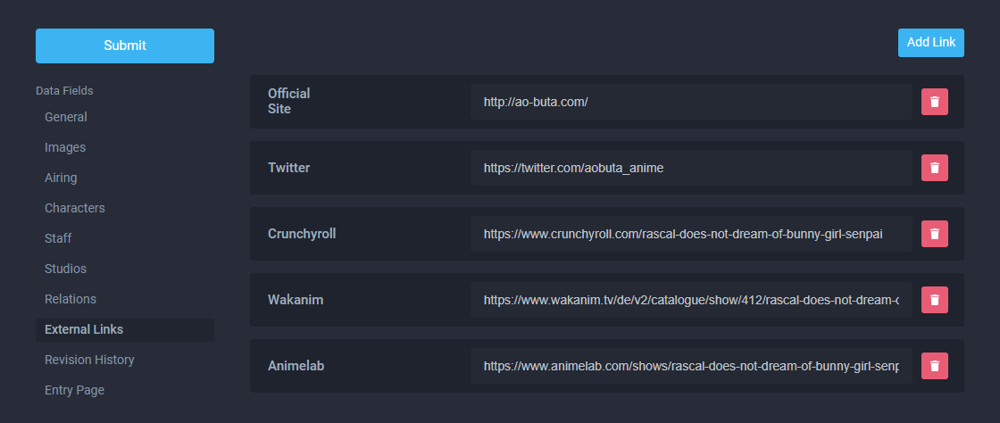

::: warning
Links that are only for purchasing the work should _**not**_ be added \(such as [Amazon](https://www.amazon.co.jp/) or [ebookjapan](https://www.ebookjapan.jp/) retail listings\).
:::

Suitable examples would be:  
[http://mitsuboshi-anime.com](http://mitsuboshi-anime.com) for [Mitsuboshi Colors](https://anilist.co/manga/87132/MitsuboshiColors) and [http://www.crunchyroll.com/fatezero](http://www.crunchyroll.com/fatezero) for [Fate/Zero](https://anilist.co/anime/10087/FateZero).

If the URL provided is not one of the supported sites listed in the next section, it will be titled with a generic ‘_official site_’.

Feel free to contact a [moderator](./#moderator-list) if you want to have another link title considered. Sites such as print or web magazines are ineligible.

::: danger
Illegal streaming and scanlation websites are _**not**_ allowed.
:::

#### Supported Sites \(Custom Titles\)

```text
Amazon
Animax
Animelab
Animenetwork
Asian Crush
Bomtoon (KO)
Comico (JP)
ComicWalker (JP)
CONtv
Crunchyroll
Dajiaochong Manhua (CN)
Daum Webtoon (CN)
Facebook
Fakku
Funimation
Hidive
Hulu
Japanese Film Archives
Justoon (KO)
KakaoPage (KO)
KuaiKan Manhua (CN)
Lezhin (EN)
Lezhin (KO)
Madman
Manga Plus
Manga.Club
Mangabox (JP)
Manman Manhua (CN)
Midnight Pulp
Naver (KO)
Netflix
Nico Nico Seiga (JP)
Piccoma (JP)
Pixiv Comic (JP)
Pixiv Novel (JP)
Pocket Magazine (JP)
QQ (CN)
Shonen Jump Plus (JP)
Sony Crackle
Toomics (EN)
Toomics (KO)
Tubi TV
Twitter
Viewster
Vimeo
Viz
VRV
Web Comics
Webtoons (EN)
Webtoons (JP)
Weibo Manhua (CN)
Youtube
```

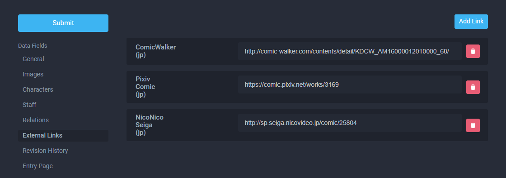


## Notify Addition

The notify addition page will display a list of all entries that are directly conntected to the current entry and how they are connected to it. On this page a moderator is able to send a notification to anyone who has the selected entries in their watching, rewatching, paused, or completed lists. A moderator is able to select or deselect any entries that are already connected to the current entry. 

::: tip
Sending out addition notifications is available to moderators only.
:::

## Submissions

The submissions page will allow a moderator to see what currently pending submissions may exist for an entry. This is the page that is automatically brought up when a moderator clicks on a submission in the submission queue for an entry.

::: tip
If multiple submissions currently exist for a single entry, the oldest will appear at the top.
:::

::: tip
This page is visible to moderators only.
:::

## Revision History

The revision history will show a feed displaying which users have modified the entry. The changes they made can be viewed by clicking on each record.

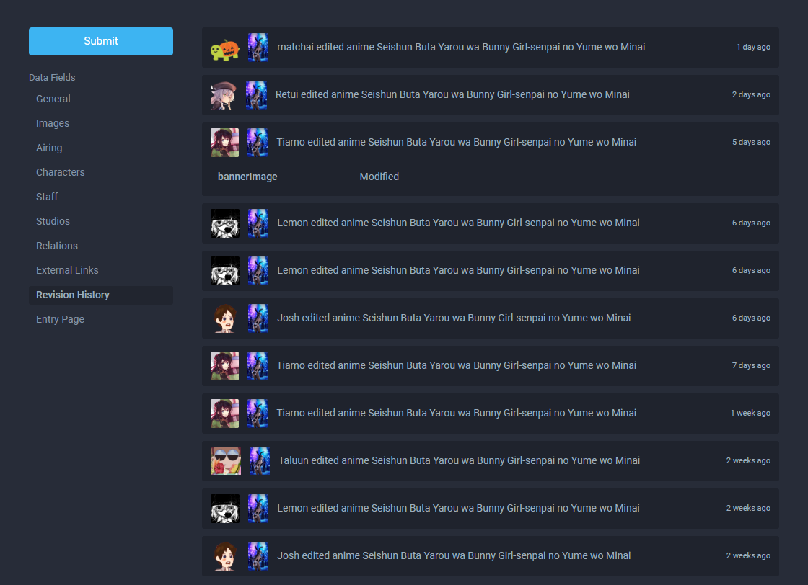
