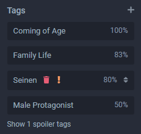
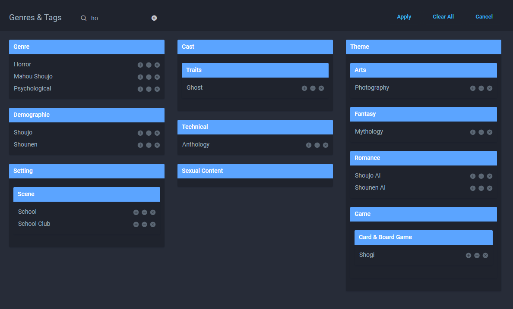

## Tag Management

The tag list can be viewed at the bottom left of each entry page.

Tags are not part of the submission system, but still very important. If you do submit any new entries, it would be massively appreciated if you could add tags once the entry is approved, marking some as spoilers if needed.

Tags for each entry are entirely user-managed, with all users being able to add tags and vote on their relevance to the work in question. The results can then be filtered through in the ‘Browse’ section of the website.

If you wish to submit a new tag, all you have to do is type in the name and submit - it’ll then be looked into and approved or denied.

::: tip
Tags can be marked as a spoiler using the exclamation mark icon, or removed with the trash icon. This feature is not available to standard users.
:::

::: warning
The power of each user's vote is limited to restrict abuse. If you feel that tags have been added incorrectly, submit an edit to the entry where you simply comment in the [Submission Sources & Notes](./submissions.html#submission-sources-notes) box why the tags should be removed. 
:::

## Tag Requests

For the most part, any new tag that is requested by a user will be discussed between the moderators and sometimes users themselves before a decision on whether to include them or not is made. Ideally, tags should not be ones that are often considered subjective, such as 'moe', and not as descriptive as eye color. Browsing the list of tags is the best measure of seeing what type of content could be approved.

## Tag List

Using the filter button on the [Browse](https://anilist.co/search/anime) page and then expanding the 'Advanced Genres & Tag Filters' section will give you a list of available tags, with descriptions on mouse hover.

::: tip
A dedicated page in a table layout will be implemented at a later date.
:::
